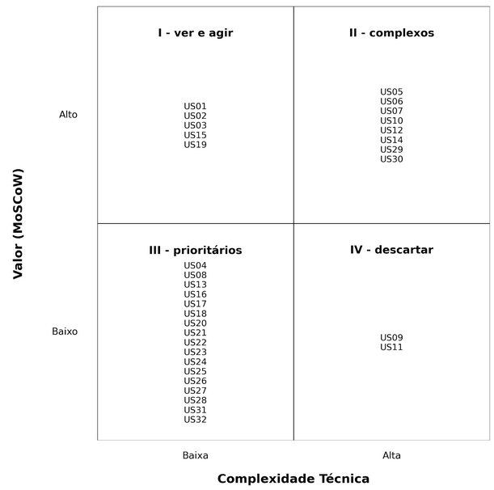

# Backlog do Produto

Esta seção descreve o backlog de produto, uma lista priorizada de todas as funcionalidades e melhorias planejadas para o software. A priorização foi realizada com base no modelo **MoSCoW**(Must Have, Should Have, Could Have, Won’t Have por agora), considerando os objetivos estratégicos do projeto e os requisitos funcionais definidos. O MVP (Produto Mínimo Viável) será composto pelos itens classificados como **Must Have**. 

Os requisitos funcionais mapeados neste backlog foram derivados a partir de três objetivos estratégicos principais, definidos em alinhamento com as necessidades da plataforma e dos usuários:

- **Objetivo 1** – Aumentar captação de clientes em %
- **Objetivo 2** – Reduzir a sobrecarga de atendimentos iniciais repetitivos
- **Objetivo 3** – Oferecer informações e apoio ao intercambista durante o período no exterior

Esses objetivos servem como base para a estruturação e priorização dos itens do backlog, garantindo que as funcionalidades estejam alinhadas com as metas do projeto.

## Backlog Geral

O backlog geral contém todas as funcionalidades e melhorias planejadas para o software. Cada item é detalhado e priorizado para garantir uma visão clara do que será desenvolvido ao longo do projeto. 

| Código RF | Requisito | Código US | User Story | Referente a | Épico |
|-----------|-----------|-----------|------------|-------------|-------|
| RF01 | Registrar-se como potencial intercambista, preenchendo dados básicos (nome, sobrenome, email, telefone com DDD, cidade, qual a unidade mais próxima do usuário, senha, confirmar senha) | US01 | Como potencial intercambista, quero me registrar preenchendo meus dados básicos para criar uma conta na plataforma. | Potencial Intercambista | EP01 - Cadastro e Acesso |
| RF02 | Fazer login na plataforma como potencial intercambista, intercambista e administrador | US02 | Como usuário da plataforma, quero fazer login com minhas credenciais para acessar meu ambiente personalizado. | Todos os usuários | EP01 - Cadastro e Acesso |
| RF03 | Editar perfil na plataforma como potencial intercambista e administrador | US03 | Como usuário, quero editar meu perfil na plataforma para manter minhas informações atualizadas. | Potencial Intercambista | EP01 - Cadastro e Acesso |
| RF04 | Excluir conta da plataforma como potencial intercambista, intercambista e administrador | US04 | Como usuário, quero excluir minha conta da plataforma para encerrar meu vínculo com o sistema. | Potencial Intercambista | EP01 - Cadastro e Acesso |
| RF05 | Responder um teste para identificar o perfil ideal de intercâmbio do usuário com base nas respostas. | US05 | Como potencial intercambista, quero responder um teste para descobrir qual programa combina mais com meu perfil. | Potencial Intercambista | EP02 - Testes e Quizzes |
| RF06 | Navegar por programas | US06 | Como potencial intercambista, quero navegar por programas. | Potencial Intercambista | EP03 - Navegação e Exploração de Programas |
| RF07 | Responder um quiz específico sobre os programas da Canada Intercambio para verificar o entendimento do usuário sobre as opções disponíveis. | US07 | Como potencial intercambista, quero responder um quiz sobre os programas da Canada Intercambio para verificar meu entendimento sobre as opções. | Potencial Intercambista | EP02 - Testes e Quizzes |
| RF08 | Responder um quiz de nivelamento de inglês com perguntas objetivas elaboradas para avaliar o domínio da língua. | US08 | Como potencial intercambista, quero responder um quiz de nivelamento de inglês para saber meu nível de domínio da língua. | Potencial Intercambista | EP02 - Testes e Quizzes |
| RF09 | Responder um quiz sobre aspectos culturais e geográficos do Canadá. | US09 | Como potencial intercambista, quero responder um quiz sobre cultura e geografia do Canadá para me preparar melhor para o intercâmbio. | Potencial Intercambista | EP02 - Testes e Quizzes |
| RF10 | Visualizar sugestão de programa com base nas respostas dos quizzes e testes. | US10 | Como potencial intercambista, quero visualizar sugestões de programas com base nas respostas dos quizzes para facilitar minha decisão. | Potencial Intercambista | EP03 - Navegação e Exploração de Programas |
| RF11 | Simular o custo estimado dos programas de intercâmbio | US11 | Como potencial intercambista, quero simular o custo estimado dos programas de intercâmbio para planejar meus gastos. | Potencial Intercambista | EP03 - Navegação e Exploração de Programas |
| RF12 | Visualizar respostas para dúvidas frequentes | US12 | Como potencial intercambista, quero visualizar respostas para dúvidas frequentes para esclarecer minhas principais questões. | Potencial Intercambista | EP03 - Navegação e Exploração de Programas |
| RF13 | Acessar uma área com promoções ativas. | US13 | Como potencial intercambista, quero acessar uma área com promoções ativas para aproveitar oportunidades de desconto. | Potencial Intercambista | EP03 - Navegação e Exploração de Programas |
| RF14 | Visualizar informações detalhadas de cada programa (duração, país, valor, requisitos) | US14 | Como potencial intercambista, quero visualizar informações detalhadas de cada programa para comparar e escolher o melhor para mim. | Potencial Intercambista | EP03 - Navegação e Exploração de Programas |
| RF15 | Solicitar contato com um especialista da Canada Intercambio | US15 | Como potencial intercambista, quero solicitar contato com um especialista da Canada Intercambio para esclarecer dúvidas sobre os programas. | Potencial Intercambista | EP04 - Suporte e Contato |
| RF16 | Editar perfil na plataforma como intercambista já matriculado (como contato de emergência) | US16 | Como intercambista já matriculado, quero editar meu perfil para atualizar informações como contato de emergência. | Intercambista | EP01 - Cadastro e Acesso |
| RF17 | Acessar o contrato digital assinado do programa de intercâmbio contratado. | US17 | Como intercambista, quero acessar meu contrato digital assinado para consultar detalhes do meu programa. | Intercambista | EP05 - Área do Intercambista |
| RF18 | Visualizar atividades no cronograma do programa de intercâmbio | US18 | Como intercambista, quero visualizar as atividades no cronograma do meu programa de intercâmbio para acompanhar minha jornada. | Intercambista | EP05 - Área do Intercambista |
| RF19 | Criar conta como empresa preenchendo dados básicos (nome, sobrenome, email corporativo, senha, confirmar senha, número, função, filial) | US19 | Como empresa, quero criar uma conta preenchendo meus dados básicos para utilizar a plataforma de intercâmbio. | Empresa | EP01 - Cadastro e Acesso |
| RF20 | Alterar tipo de conta de um potencial intercambista para uma conta de intercambista após um fechamento de contrato. | US20 | Como empresa, quero alterar o tipo de conta de um potencial intercambista para intercambista após o fechamento de contrato para refletir o status atual. | Empresa | EP06 - Gestão da Conta Corporativa / Empresa |
| RF21 | Consultar informações preenchidas e perfil do potencial intercambista para atendimento. | US21 | Como empresa, quero consultar as informações e o perfil de um potencial intercambista para realizar um atendimento mais assertivo. | Empresa | EP06 - Gestão da Conta Corporativa / Empresa |
| RF22 | Consultar respostas e recomendações do quiz do programa | US22 | Como empresa, quero consultar as respostas e recomendações do quiz do programa para entender o perfil do intercambista. | Empresa | EP06 - Gestão da Conta Corporativa / Empresa |
| RF23 | Consultar o nível de inglês do aluno baseado no quiz | US23 | Como empresa, quero consultar o nível de inglês do aluno baseado no quiz para indicar os programas adequados. | Empresa | EP06 - Gestão da Conta Corporativa / Empresa |
| RF24 | Ver desempenho do aluno no quiz cultural | US24 | Como empresa, quero ver o desempenho do aluno no quiz cultural para avaliar seu conhecimento sobre o Canadá. | Empresa | EP06 - Gestão da Conta Corporativa / Empresa |
| RF25 | Cadastrar o contrato do intercambista na plataforma | US25 | Como empresa, quero cadastrar o contrato do intercambista na plataforma para formalizar a contratação. | Empresa | EP06 - Gestão da Conta Corporativa / Empresa |
| RF26 | Inserir as atividades no cronograma de cada programa | US26 | Como empresa, quero inserir as atividades no cronograma dos programas para organizar a agenda dos intercambistas. | Empresa | EP06 - Gestão da Conta Corporativa / Empresa |
| RF27 | Editar as atividades no cronograma de cada programa | US27 | Como empresa, quero editar as atividades no cronograma para manter o planejamento atualizado. | Empresa | EP06 - Gestão da Conta Corporativa / Empresa |
| RF28 | Adicionar promoções | US28 | Como empresa, quero adicionar promoções para atrair mais potenciais intercambistas. | Empresa | EP06 - Gestão da Conta Corporativa / Empresa |
| RF29 | Atualizar informações de programas existentes | US29 | Como empresa, quero atualizar informações de programas existentes para garantir que os dados estejam corretos e atualizados. | Empresa | EP06 - Gestão da Conta Corporativa / Empresa |
| RF30 | Cadastrar novos programas de intercâmbio | US30 | Como empresa, quero cadastrar novos programas de intercâmbio para expandir a oferta da plataforma. | Empresa | EP06 - Gestão da Conta Corporativa / Empresa |
| RF31 | Inserir dados de novos intercambistas contratados | US31 | Como empresa, quero inserir os dados de novos intercambistas contratados para começar o acompanhamento do programa. | Empresa | EP06 - Gestão da Conta Corporativa / Empresa |
| RF32 | Excluir conta do intercambista após a conclusão do programa | US32 | Como empresa, quero excluir a conta de um intercambista após a conclusão do programa para manter o sistema limpo e organizado. | Empresa | EP01 - Cadastro e Acesso |

---

## Priorização do Backlog Geral

A priorização de valor de negócio foi feita com base na técnica MoSCoW, conforme descrito abaixo:

- **Must Have (Essenciais):** Funcionalidades sem as quais o MVP não é viável. Devem ser entregues obrigatoriamente na primeira versão.
- **Should Have (Importantes):** São importantes, mas podem ser entregues após o MVP sem comprometer sua funcionalidade.
- **Could Have (Desejáveis):** Funcionalidades de valor, mas que não impactam diretamente os objetivos iniciais.
- **Won’t Have (Por enquanto):** Não serão consideradas neste ciclo de desenvolvimento.

Para definir essa classificação, aplicamos uma metodologia baseada em três perguntas-chave (perguntas-passe), com o objetivo de pontuar cada história de usuário de 0 a 3:

**1.**  A funcionalidade é essencial para captar clientes nos dois primeiros meses?
**2.**  Ela é necessária para que o usuário conclua um ciclo básico na plataforma (descoberta → teste → contato)?
**3.**  Se não for feita agora, causará perda de valor ou impacto alto no MVP?

Cada resposta afirmativa somou 1 ponto. As histórias com 3 pontos foram classificadas como **Must**, com 2 pontos como **Should**, com 1 ponto como **Could**, e com 0 ponto como **Won’t**.

Para a priorização técnica, aplicamos uma metodologia baseada em três perguntas-chave (perguntas-passe), com o objetivo de pontuar cada história de usuário de 1 a 4, considerando os principais obstáculos que podem dificultar sua implementação. Quanto maior a pontuação total, maior o esforço necessário.

**1.**  A tarefa envolve lógica difícil, uso de tecnologias novas ou integrações técnicas complexas?
**2.**  A tarefa vai demandar muitos dias úteis  para ser concluída?
**3.**  Essa tarefa depende de APIs de terceiros, serviços externos ou parceiros fora do nosso controle?

Feitas as duas priorizações, classificamos cada uma em A (alto, >=2) ou B (baixo, <2), e dividimos em quadrantes:

- I - AB - Ver e agir
- II - AA - Complexos
- III - BB - Prioritários
- IV - BA - Descartar

O diagrama de quadrantes fica da seguinte forma:

Também levamos em consideração as diretrizes estratégicas da empresa:

- A prioridade principal é captar clientes.
- A área do intercambista não será foco do MVP.
- A área da empresa precisa garantir autonomia para cadastrar e editar seus próprios programas.

### Tabela

| Código | User Story | Pontuação | MoSCoW | Classificação MoSCoW | Pontuação Técnica | Classificação |
|--------|------------|-----------|--------|-----------------------|-------------------|---------------|
| US01 | Como potencial intercambista, quero me registrar preenchendo meus dados básicos para criar uma conta na plataforma. | 3A | Must Have | 1B | AB - 1 ||
| US02 | Como usuário da plataforma, quero fazer login com minhas credenciais para acessar meu ambiente personalizado | 3A | Must Have | 1B | AB - 1 ||
| US03 | Como usuário, quero editar meu perfil na plataforma para manter minhas informações atualizadas. | 2A | Should Have | 1B | AB - 1 ||
| US04 | Como usuário, quero excluir minha conta da plataforma para encerrar meu vínculo com o sistema. | 1B | Could Have | 1B | BB - 3 ||
| US05 | Como potencial intercambista, quero responder um teste para descobrir qual programa combina mais com meu perfil. | 3A | Must Have | 3A | AA - 2 ||
| US06 | Como potencial intercambista, quero navegar por programas. | 3A | Must Have | 2A | AA - 2 ||
| US07 | Como potencial intercambista, quero responder um quiz sobre os programas da Canada Intercambio para verificar meu entendimento sobre as opções. | 3A | Should Have | 2A | AA - 2 ||
| US08 | Como potencial intercambista, quero responder um quiz de nivelamento de inglês para saber meu nível de domínio da língua. | 1B | Could Have | 2B | BB - 3 ||
| US09 | Como potencial intercambista, quero responder um quiz sobre cultura e geografia do Canadá para me preparar melhor para o intercâmbio. | 1B | Could Have | 2A | BA - 4 ||
| US10 | Como potencial intercambista, quero visualizar sugestões de programas com base nas respostas dos quizzes para facilitar minha decisão. | 3A | Must Have | 3A | AA - 2 ||
| US11 | Como potencial intercambista, quero simular o custo estimado dos programas de intercâmbio para planejar meus gastos. | 1A | Should Have | 3B | BA - 4 ||
| US12 | Como potencial intercambista, quero visualizar respostas para dúvidas frequentes para esclarecer minhas principais questões. | 3A | Must Have | 2A | AA - 2 ||
| US13 | Como potencial intercambista, quero acessar uma área com promoções ativas para aproveitar oportunidades de desconto. | 1B | Should Have | 1B | BB - 3 ||
| US14 | Como potencial intercambista, quero visualizar informações detalhadas de cada programa para comparar e escolher o melhor para mim. | 3A | Must Have | 2A | AA - 2 ||
| US15 | Como potencial intercambista, quero solicitar contato com um especialista da Canada Intercambio para esclarecer dúvidas sobre os programas. | 3A | Must Have | 1B | AB - 1 ||
| US16 | Como intercambista já matriculado, quero editar meu perfil para atualizar informações como contato de emergência || 1B | Could Have | 1B | BB - 3 |
| US17 | Como intercambista, quero acessar meu contrato digital assinado para consultar detalhes do meu programa. | 1B | Could Have | 1B | BB - 3 ||
| US18 | Como intercambista, quero visualizar as atividades no cronograma do meu programa de intercâmbio para acompanhar minha jornada | 1B | Could Have | 1A | BB - 3 ||
| US19 | Como empresa, quero criar uma conta preenchendo meus dados básicos para utilizar a plataforma de intercâmbio. | 3A | Must Have | 1B | AB - 1 ||
| US20 | Como empresa, quero alterar o tipo de conta de um potencial intercambista para intercambista após o fechamento de contrato para refletir o status atual. | 1B | Could Have | 1B | BB - 3 ||
| US21 | Como empresa, quero consultar as informações e o perfil de um potencial intercambista para realizar um atendimento mais assertivo. | 1B | Should Have | 1B | BB - 3 ||
| US22 | Como empresa, quero consultar as respostas e recomendações do quiz do programa para entender o perfil do intercambista. | 1B | Should Have | 1B | BB - 3 ||
| US23 | Como empresa, quero consultar o nível de inglês do aluno baseado no quiz para indicar os programas adequados. | 1B | Should Have | 1B | BB - 3 ||
| US24 | Como empresa, quero ver o desempenho do aluno no quiz cultural para avaliar seu conhecimento sobre o Canadá. | 1B | Should Have | 1B | BB - 3 ||
| US25 | Como empresa, quero cadastrar o contrato do intercambista na plataforma para formalizar a contratação. | 1B | Could Have | 1B | BB - 3 ||
| US26 | Como empresa, quero inserir as atividades no cronograma dos programas para organizar a agenda dos intercambistas. | 1B | Could Have | 1B | BB - 3 ||
| US27 | Como empresa, quero editar as atividades no cronograma para manter o planejamento atualizado. | 1B | Could Have | 1B | BB - 3 ||
| US28 | Como empresa, quero adicionar promoções para atrair mais potenciais intercambistas. | 1B | Should Have | 1B | BB - 3 ||
| US29 | Como empresa, quero atualizar informações de programas existentes para garantir que os dados estejam corretos e atualizados. | 3A | Must Have | 2A | AA - 2 ||
| US30 | Como empresa, quero cadastrar novos programas de intercâmbio para expandir a oferta da plataforma. | 3A | Must Have | 2A | AA - 2 ||
| US31 | Como empresa, quero inserir os dados de novos intercambistas contratados para começar o acompanhamento do programa. | 1B | Could Have | 1B | BB - 3 ||
| US32 | Como empresa, quero excluir a conta de um intercambista após a conclusão do programa para manter o sistema limpo e organizado. | 1B | Could Have | 1B | BB - 3 ||
