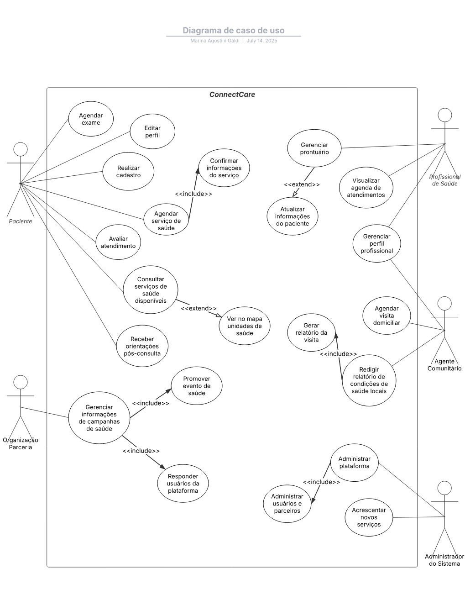

# Casos de Uso

O caso de uso escolhido pela nossa equipe foi o ConnectCare. Seguem o documento com as informações do caso.

[Clique aqui para visualizar o documento](Exercício de Construção de Diagrama de UC - ConnectCare.pdf)

## Diagrama

## Especificações de Casos de Uso

### Visualizar Agenda de Atendimentos

#### Descrição Geral

- **Nome do Caso de Uso:** Visualizar agenda de atendimentos
- **Breve descrição:** Permite ao Profissional de Saúde acessar sua agenda de atendimentos no sistema, com visualização por dia, tipo e status. Essa função apoia o planejamento de serviços de saúde prestados à comunidade.
- **Atores:** Profissional de Saúde

#### Fluxo de Eventos

- **Fluxo Principal:**

1. O Profissional acessa o sistema e realiza login com suas credenciais.
2. O sistema valida as credenciais e redireciona o usuário à tela inicial.
3. O Profissional seleciona “Agenda de Atendimentos” no menu principal.
4. O sistema exibe a agenda atual contendo:
   - Nome dos pacientes  
   - Horários dos atendimentos  
   - Tipo de serviço (consulta, exame, visita)  
   - Status (confirmado, pendente, cancelado)
5. O Profissional pode aplicar filtros por data, tipo ou status.
6. O sistema atualiza a agenda conforme os filtros.
7. O Profissional pode acionar “Exportar Agenda” (ver ponto de extensão).
8. O caso de uso termina quando o Profissional retorna ao menu ou encerra a sessão.

- **Fluxos Alternativos:**

**FA01 – Agenda Vazia**

- **Origem:** Passo 4  
- **Condição:** Nenhum atendimento encontrado para a data selecionada  
- **Ação:**
  - O sistema exibe: “Nenhum atendimento agendado para este período.”
  - Mantém filtros ativos  
  - **Retorna ao passo 5 do fluxo principal**

- **Fluxos de Exceção:**

**FE01 – Falha na comunicação com o servidor**

- **Origem:** Passo 4  
- **Condição:** Falha ao carregar a agenda  
- **Ação:**
  - O sistema exibe: “Não foi possível acessar a agenda. Verifique sua conexão ou tente novamente mais tarde.”
  - Permanece na tela com botão de recarregar

- **Requisitos Especiais:**

    - **RE01:** A agenda deve carregar em no máximo 3 segundos.  
    - **RE02:** Deve funcionar em dispositivos de baixa performance.  
    - **RE03:** Deve funcionar offline com cache local.  
    - **RE04:** Interface responsiva e acessível para toque e leitura.

- **Regras de Negócio:**

    - **RN01:** A agenda exibida deve pertencer exclusivamente ao profissional autenticado.  
    - **RN02:** Todos os acessos à funcionalidade devem ser registrados para auditoria.

- **Pré-condições:**

    - O usuário deve estar autenticado com sucesso.  
    - Deve existir uma agenda associada ao perfil, mesmo que sem atendimentos.

- **Pós-condições**

    - A agenda foi carregada com sucesso, ou uma tentativa foi registrada no log do sistema.

#### Ponto de Extensão

- **Exportar Agenda em PDF:**

    - **Local:** Após o passo 6 do fluxo principal  
    - **Descrição:** O profissional pode clicar em “Exportar Agenda” para gerar um arquivo PDF da visualização atual.

---

### Agendar Exame

#### Descrição Geral

- **Nome do Caso de Uso:** Agendar Exame  
- **Breve descrição:** Permite ao paciente agendar um exame por meio do sistema ConnectCare, selecionando especialidade, turno e possibilidade de atendimento.  
- **Atores:** Paciente

#### Fluxo de Eventos

- **Fluxo Principal:**

1. O paciente seleciona a opção “Agendar exame”.
2. O sistema recupera a localização do paciente.
3. O paciente seleciona a especialidade desejada.
4. O paciente digita o turno de preferência.
5. O sistema mostra as principais possibilidades de atendimento, em ordem decrescente de data (ver FA03).
6. O paciente clica em uma possibilidade de atendimento.
7. O sistema exibe uma caixa de confirmação.
8. O paciente confirma o agendamento.
9. O sistema envia um e-mail de confirmação.

- **Fluxos Alternativos:**

**FA01 – Paciente não escolhe especialidade**

- **Origem:** Passo 3  
- **Condição:** O paciente não seleciona uma especialidade  
- **Ação:**
  - O sistema exibe a mensagem: “Por favor, selecione uma especialidade para continuar.”  
  - **Retorna ao passo 3 do fluxo principal**

**FA02 – Paciente não escolhe turno**

- **Origem:** Passo 4  
- **Condição:** O paciente não escolhe um turno de preferência  
- **Ação:**
  - O sistema exibe a mensagem: “Por favor, selecione um turno para continuar.”  
  - **Retorna ao passo 4 do fluxo principal**

**FA03 – Paciente não seleciona possibilidade de atendimento**

- **Origem:** Passo 6  
- **Condição:** O paciente não clica em nenhuma das opções de atendimento  
- **Ação:**
  - O sistema retorna à tela de opções de especialidade e turno  
  - **Retorna ao passo 3 do fluxo principal**

- **Fluxos de Exceção:**

**FE01 – Falha na Recuperação da Localização**

- **Origem:** Passo 2  
- **Condição:** O sistema não consegue recuperar a localização do paciente  
- **Ação:**
  - O sistema exibe a mensagem: “Não foi possível recuperar sua localização automaticamente.”  
  - Solicita que o paciente insira a localização manualmente  
  - O paciente insere a localização  
  - **Retorna ao passo 3 do fluxo principal**

**FE02 – Falha ao Exibir Possibilidades de Atendimento**

- **Origem:** Passo 5  
- **Condição:** O sistema falha ao carregar as possibilidades de atendimento  
- **Ação:**
  - O sistema exibe: “Erro ao carregar opções de atendimento. Tente novamente mais tarde.”  
  - O sistema tenta recarregar automaticamente  
  - Caso a falha persista, sugere contato com o suporte  
  - **Encaminha o paciente ao menu inicial**

- **Requisitos Especiais:**

    - **RE01:** O sistema deve exibir pelo menos 3 opções de atendimento ordenadas por data.  
    - **RE02:** A confirmação por e-mail deve ocorrer em até 60 segundos após o agendamento.  
    - **RE03:** O sistema deve funcionar em dispositivos móveis com internet instável.  
    - **RE04:** O tempo máximo de resposta para carregamento das opções de atendimento deve ser de 4 segundos.

- **Regras de Negócio:**

    - **RN01:** O paciente só pode agendar exames para especialidades disponíveis na sua região.  
    - **RN02:** Não é permitido mais de um agendamento por especialidade por dia.  
    - **RN03:** Todos os agendamentos devem ser associados ao CPF do paciente autenticado.  
    - **RN04:** O e-mail de confirmação deve conter a data, horário e local do exame.

- **Pré-condições:**

    - O paciente deve estar autenticado no sistema.  
    - Devem existir especialidades e horários disponíveis para agendamento.  
    - O sistema deve conseguir recuperar a localização do paciente (ou permitir entrada manual).  
    - O sistema deve estar conectado a um servidor de e-mail funcional.

- **Pós-condições**

    - O exame foi agendado com sucesso e a confirmação foi enviada por e-mail.  
    - Se o agendamento não foi concluído, nenhuma alteração foi registrada.

#### Ponto de Extensão

- **Enviar notificações via WhatsApp:** Após o envio do e-mail, o paciente pode ativar o envio de lembrete via WhatsApp com os dados do agendamento.

---

### Gerenciar Perfil Profissional

#### Descrição Geral

- **Nome do Caso de Uso:** Gerenciar Perfil Profissional  
- **Breve descrição:** Permite que o Profissional de Saúde mantenha e atualize suas informações dentro do sistema ConnectCare, incluindo qualificações, horários e dados pessoais, visando garantir informações atualizadas e acessíveis para os pacientes.  
- **Atores:** Profissional de Saúde

#### Fluxo de Eventos

- **Fluxo Principal:**

1. O Profissional de Saúde seleciona a opção “Gerenciar perfil profissional”.
2. O sistema exibe a interface com as seguintes opções:
   - Editar informações pessoais
   - Gerenciar qualificações e especialidades (ver FA01)
   - Gerenciar horários de disponibilidade/agenda (ver FA02)
   - Visualizar perfil (ver FA03)
   - Sair sem salvar (ver FA04)
3. O Profissional seleciona “Editar informações pessoais”.
4. O sistema exibe o formulário preenchido com os dados atuais.
5. O Profissional edita os dados desejados.
6. O Profissional solicita a gravação das alterações.
7. O sistema valida os dados preenchidos (ver FE01).
8. O sistema atualiza os dados no banco e exibe mensagem de sucesso.
9. O caso de uso é encerrado.

- **Fluxos Alternativos:**

**FA01 – Gerenciar Qualificações e Especialidades**

- **Origem:** Passo 2  
- **Ação:**
    - O sistema exibe a seção com diplomas e certificações.
    - O Profissional pode adicionar, editar ou remover qualificações.
    - O sistema valida os dados (ver FE01).
    - O sistema atualiza o perfil e exibe mensagem de sucesso.
    - **Encerramento do caso de uso.**

**FA02 – Gerenciar Horários de Disponibilidade/Agenda**

- **Origem:** Passo 2  
- **Ação:**
    - O sistema exibe a disponibilidade atual do profissional.
    - O Profissional pode adicionar, editar ou remover blocos de horário.
    - O sistema valida os dados (ver FE01).
    - O sistema atualiza a agenda e confirma a alteração.
    - **Encerramento do caso de uso.**

**FA03 – Visualizar Perfil**

- **Origem:** Passo 2  
- **Ação:**
    - O sistema exibe o perfil em modo somente leitura.
    - O Profissional revisa os dados e pode retornar ao menu ou sair.
    - **Encerramento do caso de uso.**

**FA04 – Sair Sem Salvar Alterações**

- **Origem:** Passo 5 ou FA01.3 ou FA02.3  
- **Ação:**
    - O sistema detecta alterações não salvas.
    - Pergunta se deseja descartá-las.
    - O Profissional confirma a saída.
    - O sistema descarta mudanças e retorna ao menu inicial.
    - **Encerramento do caso de uso.**

- **Fluxos de Exceção:**

**FE01 – Validação de Informações**

- **Origem:** Passos 7, FA01.3, FA02.3  
- **Condição:** Dados inválidos ou ausentes.  
- **Ação:**
    - O sistema exibe mensagem com erro detalhado.
    - Retorna ao passo em que o erro ocorreu.
    - Permite correção e continuação do caso de uso.

- **Requisitos Especiais:**

    - Nenhum requisito especial informado para esta funcionalidade.

- **Regras de Negócio:**

    - **RN01:** Nome completo é obrigatório.  
    - **RN02:** E-mail deve estar em formato válido.  
    - **RN03:** Telefones devem seguir padrão (XX) XXXXX-XXXX.  
    - **RN04:** Especialidades devem ser selecionadas de uma lista predefinida.  
    - **RN05:** Datas de disponibilidade devem ser futuras e com intervalo máximo de 1 ano.  
    - **RN06:** Horários de atendimento não podem se sobrepor e devem estar no horário comercial.

- **Pré-condições:**

    - O profissional deve estar autenticado.  
    - As informações do perfil devem estar previamente cadastradas.

- **Pós-condições**

    - Os dados do perfil foram atualizados com sucesso, ou uma tentativa inválida foi registrada.

#### Ponto de Extensão

- Nenhum ponto de extensão aplicável.

---

### Gerenciar Perfil Profissional

#### Descrição Geral

- **Nome do Caso de Uso:** Gerenciar Perfil Profissional  
- **Breve descrição:** Permite que o Profissional de Saúde mantenha e atualize suas informações dentro do sistema ConnectCare, incluindo qualificações, horários e dados pessoais, visando garantir informações atualizadas e acessíveis para os pacientes.  
- **Atores:** Profissional de Saúde

#### Fluxo de Eventos

- **Fluxo Principal:**

1. O Profissional de Saúde seleciona a opção “Gerenciar perfil profissional”.
2. O sistema exibe a interface com as seguintes opções:
   - Editar informações pessoais
   - Gerenciar qualificações e especialidades (ver FA01)
   - Gerenciar horários de disponibilidade/agenda (ver FA02)
   - Visualizar perfil (ver FA03)
   - Sair sem salvar (ver FA04)
3. O Profissional seleciona “Editar informações pessoais”.
4. O sistema exibe o formulário preenchido com os dados atuais.
5. O Profissional edita os dados desejados.
6. O Profissional solicita a gravação das alterações.
7. O sistema valida os dados preenchidos (ver FE01).
8. O sistema atualiza os dados no banco e exibe mensagem de sucesso.
9. O caso de uso é encerrado.

- **Fluxos Alternativos:**

**FA01 – Gerenciar Qualificações e Especialidades**

- **Origem:** Passo 2  
- **Ação:**
    - O sistema exibe a seção com diplomas e certificações.
    - O Profissional pode adicionar, editar ou remover qualificações.
    - O sistema valida os dados (ver FE01).
    - O sistema atualiza o perfil e exibe mensagem de sucesso.
    - **Encerramento do caso de uso.**

**FA02 – Gerenciar Horários de Disponibilidade/Agenda**

- **Origem:** Passo 2  
- **Ação:**
    - O sistema exibe a disponibilidade atual do profissional.
    - O Profissional pode adicionar, editar ou remover blocos de horário.
    - O sistema valida os dados (ver FE01).
    - O sistema atualiza a agenda e confirma a alteração.
    - **Encerramento do caso de uso.**

**FA03 – Visualizar Perfil**

- **Origem:** Passo 2  
- **Ação:**
    - O sistema exibe o perfil em modo somente leitura.
    - O Profissional revisa os dados e pode retornar ao menu ou sair.
    - **Encerramento do caso de uso.**

**FA04 – Sair Sem Salvar Alterações**

- **Origem:** Passo 5 ou FA01.3 ou FA02.3  
- **Ação:**
    - O sistema detecta alterações não salvas.
    - Pergunta se deseja descartá-las.
    - O Profissional confirma a saída.
    - O sistema descarta mudanças e retorna ao menu inicial.
    - **Encerramento do caso de uso.**

- **Fluxos de Exceção:**

**FE01 – Validação de Informações**

- **Origem:** Passos 7, FA01.3, FA02.3  
- **Condição:** Dados inválidos ou ausentes.  
- **Ação:**
    - O sistema exibe mensagem com erro detalhado.
    - Retorna ao passo em que o erro ocorreu.
    - Permite correção e continuação do caso de uso.

- **Requisitos Especiais:**

    - Nenhum requisito especial informado para esta funcionalidade.

- **Regras de Negócio:**

    - **RN01:** Nome completo é obrigatório.  
    - **RN02:** E-mail deve estar em formato válido.  
    - **RN03:** Telefones devem seguir padrão (XX) XXXXX-XXXX.  
    - **RN04:** Especialidades devem ser selecionadas de uma lista predefinida.  
    - **RN05:** Datas de disponibilidade devem ser futuras e com intervalo máximo de 1 ano.  
    - **RN06:** Horários de atendimento não podem se sobrepor e devem estar no horário comercial.

- **Pré-condições:**

    - O profissional deve estar autenticado.  
    - As informações do perfil devem estar previamente cadastradas.

- **Pós-condições**

    - Os dados do perfil foram atualizados com sucesso, ou uma tentativa inválida foi registrada.

#### Ponto de Extensão

- Nenhum ponto de extensão aplicável.

---

### Receber Orientações Pós-Consulta

#### Descrição Geral

- **Nome do Caso de Uso:** Receber Orientações Pós-Consulta  
- **Breve descrição:** Após a realização de uma consulta médica, o paciente acessa a plataforma ConnectCare para visualizar as orientações fornecidas pelo profissional de saúde. Essas orientações incluem instruções sobre medicamentos, cuidados recomendados, necessidade de retorno e agendamento de exames.  
- **Atores:** Paciente

#### Fluxo de Eventos

- **Fluxo Principal:**

1. O paciente acessa a plataforma ConnectCare com seu login.
2. O sistema valida as credenciais e exibe o painel do usuário.
3. O paciente seleciona a opção "Consultas Anteriores".
4. O sistema apresenta a lista de consultas realizadas.
5. O paciente seleciona uma consulta para visualizar detalhes.
6. O sistema exibe as orientações pós-consulta registradas pelo profissional de saúde.
7. O paciente lê as orientações e, se aplicável, acessa links para agendamento de exames recomendados.
8. O sistema registra a visualização das orientações.

- **Fluxos Alternativos:**

**FA01 – Consulta Sem Orientações**

- **Origem:** Passo 6  
- **Condição:** A consulta selecionada não possui orientações registradas  
- **Ação:**
  - O sistema exibe: “Nenhuma orientação disponível para esta consulta.”  
  - **Retorna ao passo 4 do fluxo principal**

**FA02 – Exame Já Agendado**

- **Origem:** Passo 7  
- **Condição:** O exame recomendado já está agendado  
- **Ação:**
  - O sistema exibe: “Exame referente a esta consulta já foi agendado em [data/hora].”  
  - **Retorna ao passo 8 do fluxo principal**

- **Fluxos de Exceção:**

**FE01 – Falha de Autenticação**

- **Origem:** Passo 1  
- **Condição:** Credenciais inválidas  
- **Ação:**
  - O sistema exibe: “Credenciais inválidas. Tente novamente.”  
  - **Retorna ao passo 1**

- **Requisitos Especiais:**

    - **RE01:** As orientações devem estar disponíveis mesmo com conexão limitada, utilizando cache local quando necessário.  
    - **RE02:** O sistema deve garantir a privacidade e integridade das informações médicas exibidas.  

- **Regras de Negócio:**

    - **RN01:** As orientações pós-consulta devem estar vinculadas a uma consulta previamente registrada.  
    - **RN02:** Apenas o paciente autenticado pode acessar suas próprias orientações.  
    - **RN03:** A visualização das orientações deve ser registrada para fins de auditoria.  
    - **RN04:** O agendamento de exames deve ocorrer apenas se ainda não houver registro de agendamento prévio.

- **Pré-condições:**

    - O paciente deve estar logado na plataforma.  
    - Deve existir uma consulta previamente registrada com orientações vinculadas.

- **Pós-condições**

    - As orientações são exibidas para o paciente.  
    - O paciente pode seguir um link para agendar exames solicitados.  
    - A leitura das orientações pode ser registrada no sistema.

#### Ponto de Extensão

- **Avaliar Atendimento:**
  - **Local:** Após o passo 8  
  - **Descrição:** O paciente pode avaliar a qualidade do atendimento e das orientações recebidas.

---

### Gerenciar Usuários e Parceiros

#### Descrição Geral

- **Nome do Caso de Uso:** Gerenciar Usuários e Parceiros  
- **Breve descrição:** Permite que o Administrador do Sistema gerencie os usuários da plataforma (pacientes, profissionais de saúde, agentes comunitários) e as organizações parceiras (ONGs, hospitais, instituições governamentais). As ações incluem adicionar, editar, remover e visualizar registros, garantindo controle, integridade e atualização contínua da base de dados.  
- **Atores:** Administrador do Sistema

#### Fluxo de Eventos

- **Fluxo Principal:**

1. O Administrador do Sistema acessa a funcionalidade de gerenciamento.
2. O sistema exibe as opções:
   - Gerenciar usuários
   - Gerenciar parceiros
   - Visualizar detalhes de usuário/parceiro
   - Sair
3. O Administrador seleciona "Gerenciar usuários".
4. O sistema exibe a lista de usuários cadastrados.
5. O Administrador seleciona um usuário existente ou opta por adicionar um novo.
6. O sistema exibe o formulário com os dados atuais (edição) ou em branco (criação).
7. O Administrador preenche/edita as informações e solicita gravação.
8. O sistema valida os dados inseridos [FE01].
9. O sistema atualiza ou cria o registro.
10. O sistema exibe mensagem de sucesso.
11. O caso de uso é encerrado.

- **Fluxos Alternativos:**

**FA01 – Gerenciar Usuários**

- **Origem:** Passo 2  
- O sistema exibe ações: adicionar, editar ou remover.  
- Se adicionar/editar:
  - Exibe formulário.
  - Após preenchimento, valida [FE01] e salva.
- Se remover:
  - Solicita confirmação.
  - Após confirmação, remove e exibe mensagem.
- Caso de uso é encerrado.

**FA02 – Gerenciar Parceiros**

- **Origem:** Passo 2  
- O sistema exibe ações para gerenciar parceiros:
  - Adicionar, editar, remover.
- Funciona igual a FA01 com foco em organizações parceiras.
- Validações seguem [FE01].  
- Caso de uso é encerrado.

**FA03 – Visualizar Detalhes de Usuário/Parceiro**

- **Origem:** Passo 2  
- O sistema exibe lista completa.  
- Administrador seleciona um item.  
- Sistema exibe informações em modo somente leitura.  
- Administrador retorna ao menu ou sai.  
- Caso de uso é encerrado.

**FA04 – Sair Sem Salvar Alterações**

- **Origem:** Passo 6 ou qualquer ponto com formulário aberto  
- O sistema detecta alterações não salvas.  
- Solicita confirmação para descartá-las.  
- Administrador confirma.  
- Alterações são descartadas.  
- Retorna ao menu inicial.  
- Caso de uso é encerrado.

- **Fluxos de Exceção:**

**FE01 – Validação de Informações**

- **Origem:** Passos 8 (fluxo principal), FA01.5 e FA02.5  
- O sistema identifica dados inválidos ou ausentes.  
- Exibe mensagem explicando o erro (ex: e-mail inválido).  
- Retorna ao formulário correspondente para correção.  
- Caso de uso continua após ajuste.

- **Regras de Negócio:**

**RN01 – Validação de Informações de Usuário/Parceiro**

| Campo                       | Validação                                                |
|----------------------------|-----------------------------------------------------------|
| Nome Completo (Usuário)    | Texto obrigatório                                         |
| E-mail (Usuário/Parceiro)  | Formato válido, obrigatório, e único                      |
| Telefone de Contato        | Formato (XX) XXXXX-XXXX, obrigatório                     |
| Tipo de Usuário            | Seleção obrigatória (Paciente, Profissional, Agente)     |
| Nome da Organização        | Texto obrigatório, único                                 |
| Tipo de Parceria           | Seleção obrigatória (ONG, Hospital, Governo)             |

- **Pré-condições:**

- O Administrador do Sistema deve estar autenticado na aplicação.

- **Pós-condições**

- As informações de usuários e/ou parceiros são atualizadas, criadas ou removidas com sucesso.  
- Mensagens de confirmação são exibidas ao final das ações.

- **Requisitos Especiais:**

- Nenhum requisito especial identificado.

#### Pontos de Extensão

- Não há pontos de extensão definidos para este caso de uso.

---

