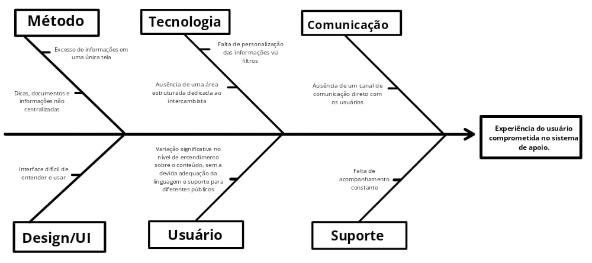

# Cenário Atual do Cliente e do Negócio

## 1.1 Introdução ao Negócio e Contexto

A **Canada Intercâmbio** é uma empresa do setor de educação internacional especializada em programas de intercâmbio no Canadá. A empresa oferece suporte completo para estudantes e profissionais que desejam estudar fora, incluindo:

- **Escolha de cursos**
- **Visto**
- **Acomodação**
- **Seguro**

Com atendimento personalizado e consultores experientes, a empresa se destaca por conectar pessoas a oportunidades educacionais no exterior.

## 1.2 Identificação da Oportunidade ou Problema

Nos últimos anos, o aumento da procura por programas de intercâmbio, especialmente no Canadá, tem trazido novos desafios para a Canada Intercâmbio. A diversidade de perfis, dúvidas frequentes e a complexidade das informações envolvidas tornam o processo de apoio ao intercambista cada vez mais exigente. Alguns dos problemas identificados incluem:

-Dificuldade de encontrar informações claras

-Insegurança e ansiedade dos estudantes e seus responsáveis

-Sobrecarga dos consultores devido a questões repetitivas

Esses fatores revelam uma falha no sistema de apoio ao intercambista, que não consegue oferecer uma experiência fluida, acessível e personalizada. Como consequência, o usuário tem sua jornada comprometida e os consultores enfrentam um uso ineficiente do tempo, presos a atendimentos operacionais e pouco estratégicos, como mostrado no diagrama abaixo:

> **Diagrama de Causa e Efeito**: A seguir, o diagrama de causa e efeito ilustra os principais elementos que contribuem para o problema.

## 1.3 Desafios do Projeto

Os principais desafios enfrentados pela empresa são:

- **Organizar e simplificar** informações sobre programas, documentação e planejamento de forma personalizada.
- **Lidar com diferentes perfis de usuários** (idade, nível de inglês, orçamento).
- **Reduzir o atendimento manual**, utilizando ferramentas que apresentem os programas e respondam dúvidas de forma autônoma e imediata.
- Garantir que os **dados fornecidos pelos clientes** (nome, idade, programa desejado, orçamento disponível, etc.) sejam organizados e úteis para a equipe de atendimento.
- **Monitoramento dos intercambistas** e suporte em todos os casos.
- Evitar **atendimentos redundantes** e sem continuidade, apenas para tirar dúvidas.

## 1.4 Segmentação de Clientes

A segmentação dos clientes e seus respectivos programas de interesse pode ser feita da seguinte forma:

### Jovens entre 13 e 18 anos (Intercâmbio Escolar)

- **Principais características**: Fortes laços com os pais ou responsáveis, interesse em vivência cultural e fluência em inglês ou francês.
- **Necessidades**:
  - Explicações claras e visuais sobre a rotina escolar
  - Comparativos entre escolas e regiões
  - Simuladores de custo
  - Conteúdo voltado aos pais (segurança e suporte local)
  - Área do aluno com dicas de adaptação, cronogramas e contatos de emergência.

### Universitários e Recém-Formados (Estudos e Trabalho)

- **Principais características**: Buscam aliar aprendizado acadêmico ao crescimento profissional.
- **Necessidades**:
  - Filtros por área de estudo, duração e possibilidade de trabalho (Co-op)
  - Simuladores de orçamento detalhados
  - Explicações sobre o Co-op, PGWP e vistos
  - Seção de depoimentos de ex-alunos
  - Chatbot com FAQs sobre carreira.

### Adultos entre 25 e 45 anos (Cursos de Idioma ou Qualificação Profissional)

- **Principais características**: Profissionais com rotinas intensas, com foco no crescimento ou recolocação no mercado de trabalho.
- **Necessidades**:
  - Comparador de cursos por carga horária e foco
  - Simuladores de custo por semana ou mês
  - Informações práticas sobre moradia e transporte
  - Agendamento ágil com consultores.

### Famílias Planejando Mudar-se para o Canadá

- **Principais características**: Planejamento a médio e longo prazo, preocupação com a educação dos filhos e estabilidade familiar.
- **Necessidades**:
  - Simuladores para famílias com múltiplos dependentes
  - Conteúdo explicativo sobre o processo de mudança
  - Consultoria humanizada com foco em acolhimento e segurança familiar.

### Intercambistas Já Matriculados

- **Principais características**: Intercambistas que precisam de suporte contínuo durante a estadia.
- **Necessidades**:
  - Área exclusiva com checklists de chegada e retorno
  - Centralização de dados do programa
  - Funcionalidades para feedback e avaliações da experiência.
