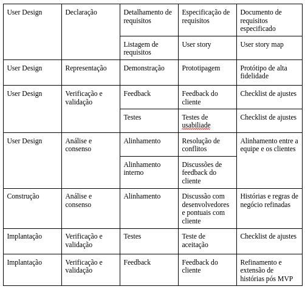

# Engenharia de Requisitos

## Atividades e Técnicas de ER

A Engenharia de Requisitos (ER) desempenha um papel crucial no desenvolvimento de software, garantindo que o produto final esteja alinhado com as necessidades dos usuários e da organização. Ela serve como a base fundamental para todo o processo de desenvolvimento. De acordo com MARSICANO (2025), a ER compreende seis atividades principais: **Elicitação e Descoberta, Análise e Consenso, Declaração, Representação, Verificação e Validação, e Organização e Atualização**.

No contexto do Rapid Application Development (RAD), que é iterativo e incremental, o foco está na prototipagem rápida e no feedback contínuo do cliente. Diferentemente dos modelos tradicionais, no RAD, as atividades de ER são integradas e revisitadas em todas as suas fases, adaptando-se à natureza dinâmica do processo.

### Fase de Levantamento de Requisitos (Requirements Planning)

Nesta fase, o objetivo principal é estabelecer o escopo do projeto, compreender os objetivos de negócio, identificar os stakeholders-chave e coletar os requisitos de alto nível.

#### Elicitação e Descoberta

- **Entrevistas com Stakeholders**: Realizar entrevistas com proprietários, usuários, gestores e outros envolvidos para entender as necessidades, expectativas e desafios relacionados ao aplicativo *CanadaWay*.
- **Brainstorming**: Realizar sessões de brainstorming para gerar uma ampla gama de requisitos e soluções criativas.
- **Análise de Documentos Existentes**: Revisar documentos como materiais de marketing, informações sobre programas e feedbacks de clientes anteriores.
- **Análise da Concorrência (Benchmarking)**: Estudar plataformas de outras empresas para identificar boas práticas e diferenciais.
- **Identificação de Stakeholders**: Mapear stakeholders do projeto e suas expectativas.

#### Análise e Consenso

- **Entrevista com Stakeholders**: Discussões em grupo para analisar os requisitos, resolver conflitos e esclarecer ambiguidades.
- **Identificação de Restrições e Riscos**: Avaliar limitações de tempo, orçamento, recursos e riscos técnicos ou de usabilidade.

#### Declaração

- **Documentação Inicial dos Requisitos**: Registrar os requisitos iniciais de forma simples e clara.
- **Mapeamento de Histórias de Usuário (User Story Map)**: Utilizar o formato "Como [tipo de usuário], quero [ação], para [benefício]" no estilo ágil.

#### Organização e Atualização

- **Priorização MoSCoW**: Classificar os requisitos como Must, Should, Could ou Won’t, conforme sua importância.

#### Verificação e Validação

- **Revisão Inicial dos Requisitos**: Reuniões com stakeholders para validar os requisitos levantados.
- **Feedback do Cliente e da Equipe**: Obter retorno através de reuniões, questionários ou discussões.
- **Critério de Prontidão (DoR)**: Garantir que os requisitos estejam claros, priorizados, com critérios de aceitação e estimativas.

### Fase de Prototipagem (User Design)

O foco principal nesta fase é desenvolver protótipos rapidamente e iterar com base no feedback contínuo do cliente.

#### Elicitação e Descoberta

- **Demonstração e Feedback Iterativo de Protótipos**: Apresentar protótipos aos stakeholders para coletar feedback e ajustar requisitos.

#### Análise e Consenso

- **Discussões do Feedback do Cliente**: Identificar melhorias e ajustes necessários.
- **Resolução de Conflitos e Esclarecimento de Ambiguidade**: Alinhar entendimento entre todos os envolvidos.

#### Declaração

- **Documentação Detalhada dos Requisitos**: Utilizar User Stories com critérios de aceitação claros.
- **User Story Mapping**: Visualizar o fluxo do usuário e planejar o desenvolvimento.

#### Representação

- **Protótipos Funcionais de Alta Fidelidade**: Desde wireframes até mockups interativos, com iteração contínua.

#### Verificação e Validação

- **Testes de Usabilidade**: Avaliar navegação e interação com usuários reais.
- **Feedback do Cliente**: Coletar retorno imediato sobre os protótipos.

### Fase de Implementação (Construção)

Nesta fase, o sistema é desenvolvido com base nos protótipos validados.

#### Organização e Atualização

- **Discussões com Desenvolvedores**: Esclarecer requisitos durante a codificação e adaptar conforme necessário.

#### Verificação e Validação

- **Testes de Integração**: Verificar a comunicação entre componentes.
- **Testes de Sistema**: Avaliar o comportamento completo do sistema.
- **Revisões de Código**: Validar aderência aos padrões e à arquitetura.

### Fase de Implantação e Entrega (Cutover)

Fase final, focada na entrega e aceitação do sistema.

#### Verificação e Validação

- **Testes de Aceitação pelo Cliente**: Confirmar se o sistema atende aos requisitos e expectativas.

#### Organização e Atualização

- **Feedback Pós-Implantação**: Coletar retorno dos usuários e planejar melhorias.

---

## Engenharia de Requisitos e o RAD

