# Casos de Uso

## Estudo de Caso 1: PBB - HealthNet

### Product Backlog Building (PBB)

O Product Backlog Building (PBB) foi desenvolvido para o estudo de caso HealthNet, organizando as histórias de usuário de forma visual e estruturada:

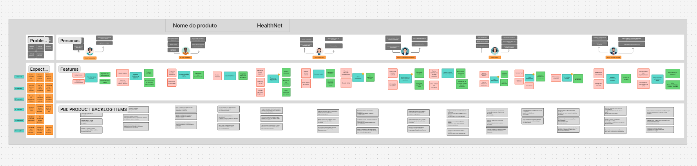
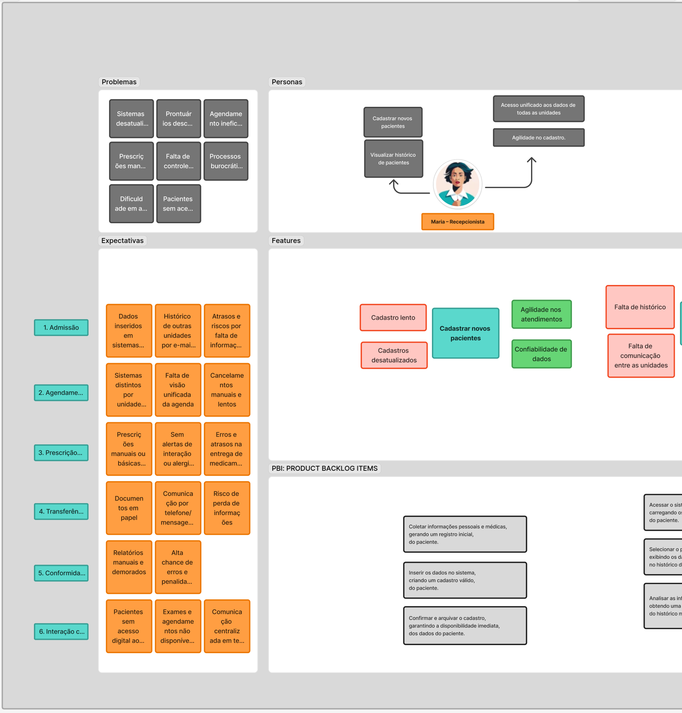 
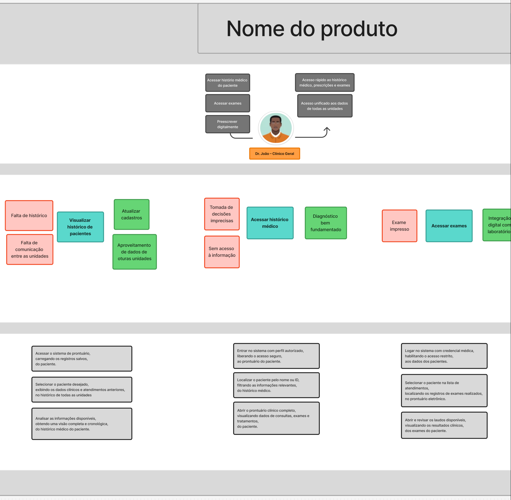 
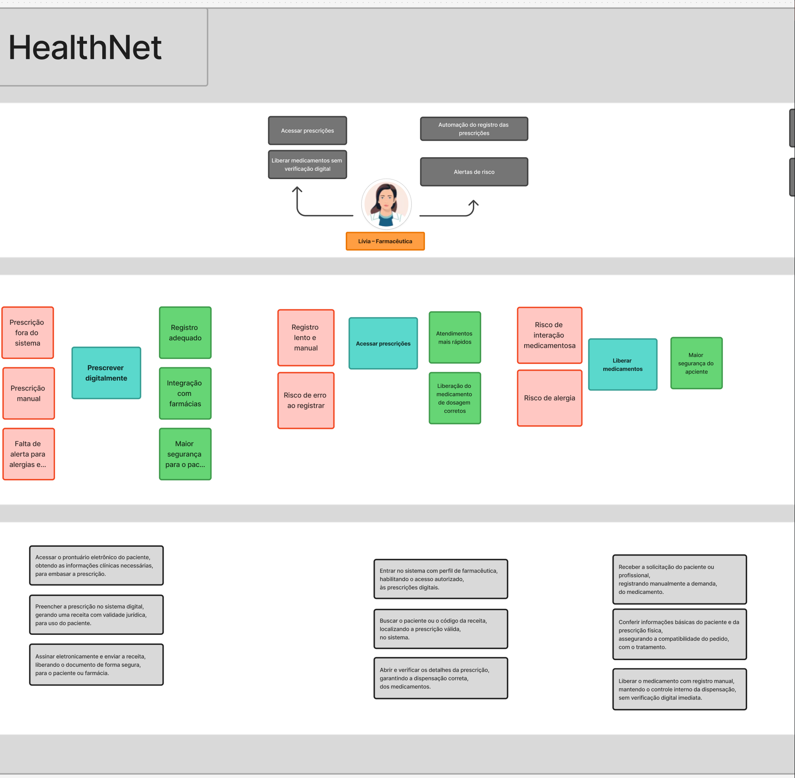 
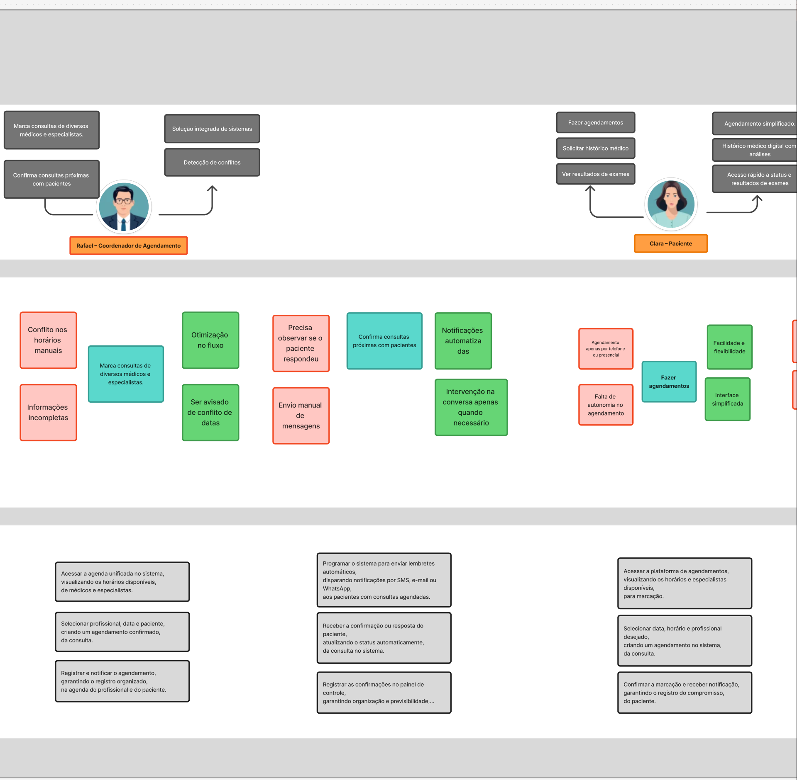 
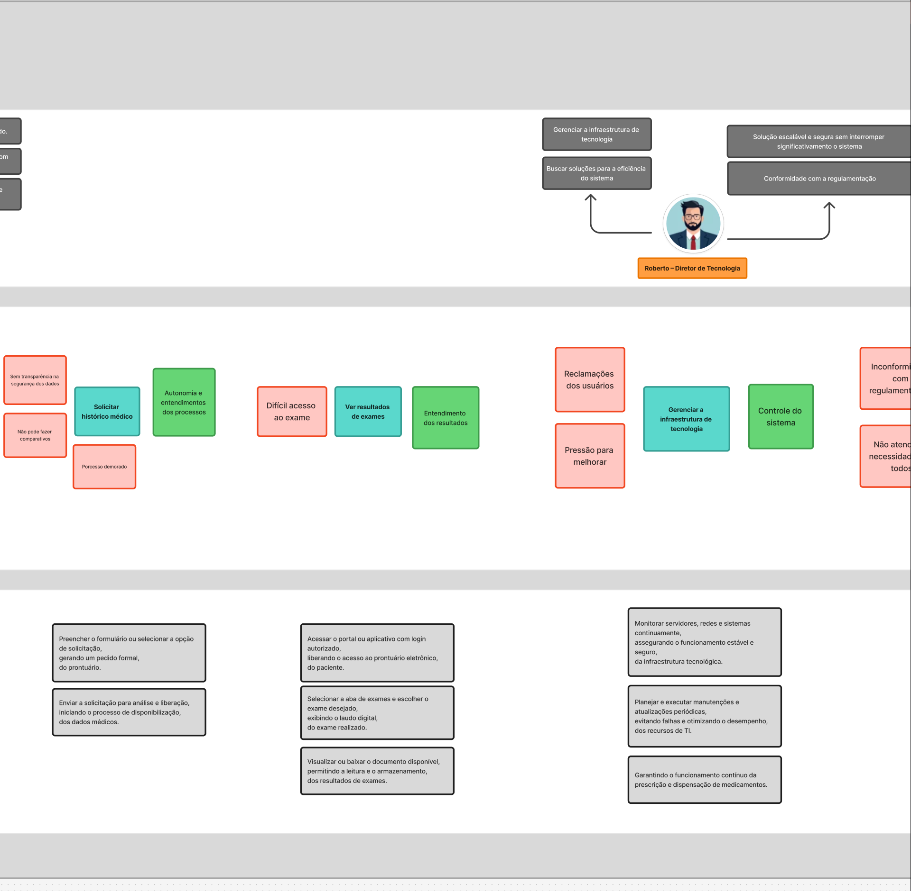 
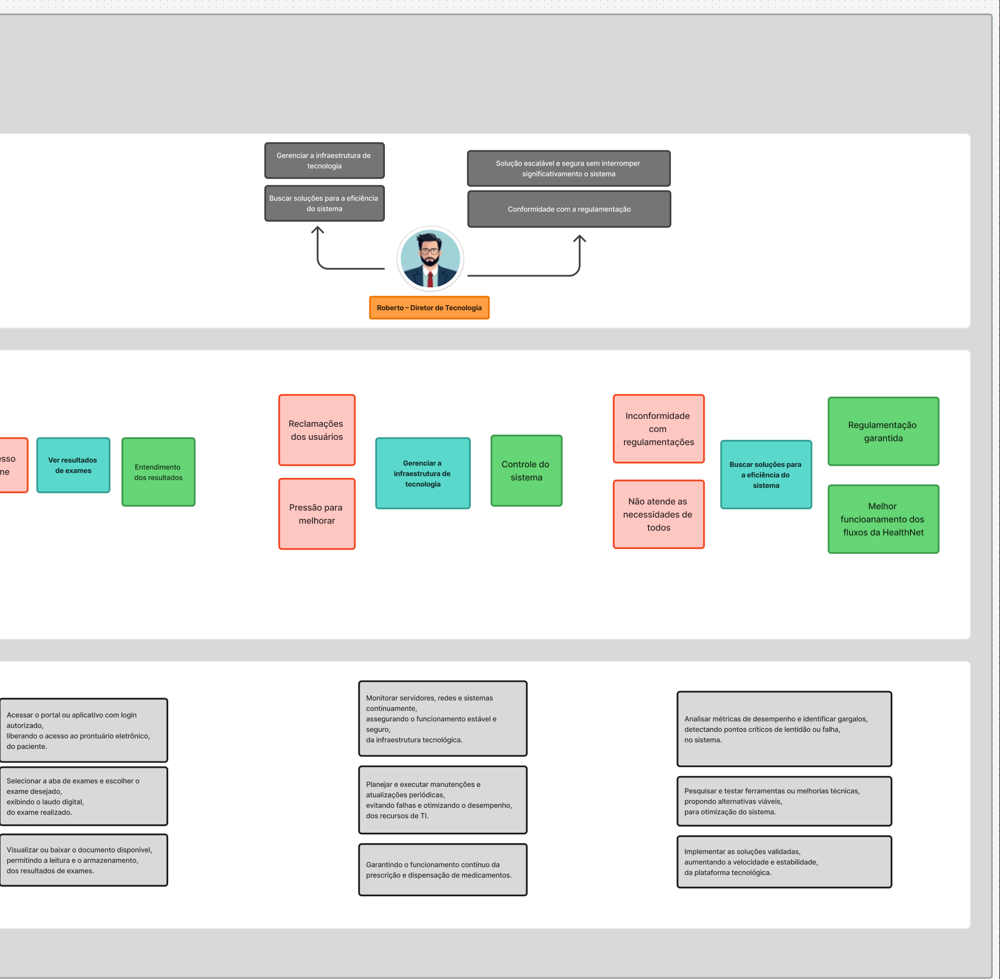 

[Acesse o PBB completo no Figma](https://www.figma.com/board/Sv2EcmVULHUxMhvc9XuMxF/Untitled?node-id=0-1&t=PQwmdDAlY8JaTPvL-1)

### BDD - HealthNet

#### Critérios de Aceitação Completos para PBIs do HealthNet

Este documento apresenta os critérios de aceitação completos para os Product Backlog Items (PBIs) do sistema HealthNet, seguindo o padrão BDD (Behavior-Driven Development).

[Acesse o documento completo do BDD no Google Docs](https://docs.google.com/document/d/1fwSefeXna3qyijbS4PAOcKDzwHNc-hFtlOh8QT_2yBk/edit?tab=t.0)

---

#### Persona: Maria – Recepcionista
**Feature:** Cadastrar novos pacientes  
**PBI:** Coletar informações pessoais e médicas, gerando um registro inicial, do paciente.
**US01 - Cadastrar paciente:** 

> Como recepcionista, Quero coletar e registrar informações pessoais e médicas de um novo paciente, Para que ele tenha um cadastro inicial completo no sistema.

**Critérios de aceitação:**
- O sistema permite preencher os seguintes campos obrigatórios: nome completo, CPF, telefone de contato e dados clínicos (alergias, comorbidades, uso de medicamentos).
- O botão “Salvar” só fica habilitado quando todos os campos obrigatórios estiverem preenchidos.
- Após o cadastro ser salvo, o sistema exibe um número identificador único na tela de confirmação.

**BDDs:** 

```gherkin
Dado que a recepcionista "Maria Souza" acessa o formulário de cadastro do paciente,
Quando ela preenche os campos obrigatórios: nome ("Lucas Pereira da Silva"), contato ("(61) 98123-4567"), CPF ("123.456.789-00") e dados clínicos ("alérgico a penicilina"),
Então o sistema valida e aceita o cadastro, pois todos os campos obrigatórios foram preenchidos corretamente.

Dado que o cadastro do paciente "Lucas Pereira da Silva" foi finalizado,
Quando o sistema confirma o registro,
Então ele gera o identificador único "PAT202407140001" e exibe uma mensagem de sucesso.
```

---

#### Persona: Maria – Recepcionista
**Feature:** Cadastrar novos pacientes  
**PBI:** Confirmar e arquivar o cadastro, garantindo a disponibilidade imediata, dos dados do paciente.
**US02 - Confirmar e arquivar cadastro:** 

> Como recepcionista, Quero confirmar e salvar o cadastro do paciente após revisão, Para que os dados fiquem disponíveis imediatamente para consulta.

**Critérios de aceitação:**
- O sistema salva o cadastro do paciente apenas após o preenchimento de todos os campos obrigatórios e confirmação pelo usuário.
- Após o cadastro ser salvo, os dados do paciente ficam disponíveis para usuários com perfil de acesso autorizado (ex: médicos, farmacêuticos).
- O sistema exibe uma mensagem de confirmação indicando que o cadastro foi salvo com sucesso.

**BDDs:**
```gherkin
Dado que a recepcionista "Maria Souza" concluiu o preenchimento do cadastro do paciente "Lucas Pereira da Silva",
Quando ela clica no botão "Confirmar cadastro",
Então o sistema salva o cadastro e exibe a mensagem "Cadastro realizado com sucesso".

Dado que o cadastro de "Lucas Pereira da Silva" foi salvo com sucesso,
Quando a médica "Dra. Ana Beatriz Lima" acessa o sistema com perfil autorizado,
Então os dados do paciente ficam disponíveis para consulta.

Dado que o cadastro foi confirmado,
Quando o sistema armazena os dados,
Então eles são registrados em uma base de dados segura com criptografia aplicada.
```

---

#### Persona: Maria – Recepcionista
**Feature:** Visualizar histórico de pacientes  
**PBI:** Selecionar o paciente desejado, exibindo os dados clínicos e atendimentos anteriores, no histórico de todas as unidades
**US03 - Visualizar histórico de pacientes:** 

> Como recepcionista, Quero acessar o histórico clínico e de atendimentos de um paciente, Para acompanhar seus registros, mesmo que atendido em outras unidades.

**Critérios de aceitação:**
- O sistema exibe os seguintes dados clínicos: alergias, comorbidades, e medicamentos em uso, além do histórico de atendimentos com data, unidade e profissional.
- A funcionalidade de histórico só é acessível a usuários com permissão específica no perfil (ex: médicos e recepcionistas).
- Se o paciente não tiver histórico registrado, o sistema exibe a mensagem: “Nenhum atendimento encontrado até o momento”.

**BDDs:**
```gherkin
Dado que a recepcionista "Maria Souza" acessa o sistema com permissão adequada,
Quando ela seleciona o paciente "Joana Carla Andrade" com atendimentos em três unidades diferentes,
Então o sistema exibe os dados clínicos (diabetes tipo 2, uso de insulina) e as datas dos atendimentos: 01/05/2024, 18/06/2024 e 02/07/2024.

Dado que o usuário "Carlos Mendes" tenta acessar o histórico do paciente sem permissão de acesso,
Quando ele acessa a funcionalidade de histórico,
Então o sistema exibe a mensagem "Acesso não autorizado".

Dado que a recepcionista acessa o histórico do paciente "Pedro Augusto Lima",
Quando nenhum atendimento está registrado no sistema,
Então o sistema exibe a mensagem "Nenhum atendimento encontrado até o momento".
```

---

#### Persona: Dr. João – Clínico Geral
**Feature:** Acessar histórico médico  
**PBI:** Entrar no sistema com perfil autorizado, liberando o acesso seguro, ao prontuário do paciente.
**US04 - Acessar prontuário com perfil autorizado:** 

> Como médico, Quero acessar o sistema com autenticação segura, Para poder visualizar o prontuário de meus pacientes.

**Critérios de aceitação:**
- Somente usuários com perfil "médico" ou "enfermeiro" conseguem acessar o sistema com autenticação válida.
- Após o login, o sistema libera acesso ao menu de prontuários médicos.
- A cada acesso ao prontuário, o sistema registra o nome do usuário, data e hora da ação em um log de auditoria visível apenas à equipe administrativa.

**BDDs:**
```gherkin
Dado que o médico "Dr. João Almeida" possui perfil autorizado,
Quando ele acessa o sistema com login "joao.almeida@clinicavida.com" e senha válida,
Então o sistema permite o login e exibe o painel de prontuários médicos.

Dado que "Dr. João Almeida" acessa o prontuário da paciente "Fernanda Lopes",
Quando ele realiza a autenticação com sucesso,
Então o acesso ao prontuário é liberado.

Dado que o prontuário de "Fernanda Lopes" foi acessado por "Dr. João Almeida",
Quando a consulta ocorre às 09:42 do dia 10/07/2025,
Então o sistema registra o acesso com usuário, data e hora no log de auditoria.
```

---

#### Persona: Dr. João – Clínico Geral
**Feature:** Acessar histórico médico  
**PBI:** Abrir o prontuário clínico completo, visualizando dados de consultas, exames e tratamentos, do paciente.
**US05 - Visualizar histórico clínico completo:** 

> Como médico, Quero visualizar em um único painel os dados de consultas, exames e tratamentos do paciente, Para compreender sua evolução clínica.

**Critérios de aceitação:**
- O sistema exibe, em um único painel, as seções de consultas, exames realizados e tratamentos prescritos, organizadas por data.
- Cada item do histórico inclui data, tipo de atendimento, profissional responsável e observações clínicas.
- Apenas usuários com perfil "médico" conseguem visualizar esse painel.

**BDDs:**
```gherkin
Dado que o médico "Dr. João Almeida" está autenticado no sistema,
Quando ele acessa o painel do paciente "Pedro Henrique Costa",
Então o sistema exibe:  
- Consultas: 12/04/2024 (gripe), 20/06/2024 (hipertensão)  
- Exames: Hemograma (15/04/2024), Eletrocardiograma (22/06/2024)  
- Tratamentos: "Losartana 50mg – 1x/dia por 30 dias"

Dado que o painel do paciente está aberto,
Quando o médico navega entre as abas,
Então os dados clínicos são apresentados de forma organizada por seção: consultas, exames e tratamentos.

Dado que o usuário "Enfermeira Camila" tenta acessar o histórico,
Quando seu perfil não possui autorização,
Então o sistema bloqueia o acesso com a mensagem "Acesso restrito".
```

---

#### Persona: Dr. João – Clínico Geral
**Feature:** Acessar exames  
**PBI:** Selecionar o paciente na lista de atendimentos, localizando os registros de exames realizados, no prontuário eletrônico.
**US06 - Visualizar exames do paciente:** 

> Como médico, Quero acessar os exames realizados do paciente a partir do prontuário eletrônico, Para acompanhar os resultados de forma organizada e filtrada.

**Critérios de aceitação:**
- O usuário pode pesquisar um paciente pelo nome ou CPF na lista de atendimentos.
- Ao selecionar o paciente, o sistema exibe os exames realizados, listados por data e tipo (ex: hemograma, raio-x).
- Somente os exames vinculados ao CPF do paciente selecionado são exibidos.

**BDDs:**
```gherkin
Dado que o médico "Dr. João Almeida" acessa a lista de atendimentos,
Quando ele pesquisa pelo CPF "456.789.123-00" e seleciona o paciente "Cláudia Martins",
Então o sistema abre o prontuário correspondente.

Dado que a paciente "Cláudia Martins" possui exames registrados,
Quando o médico visualiza a aba "Exames",
Então o sistema exibe:  
- 10/03/2025 – Hemograma – Disponível  
- 20/03/2025 – Raio-X de tórax – Disponível

Dado que o prontuário exibido é de "Cláudia Martins",
Quando o médico acessa os exames,
Então apenas os exames dela são listados, sem dados de outros pacientes.
```

---

#### Persona: Dr. João – Clínico Geral
**Feature:** Prescrever digitalmente  
**PBI:** Assinar eletronicamente e enviar a receita, liberando o documento de forma segura, para o paciente ou farmácia.
**US07 - Prescrever digitalmente:** 

> Como médico, Quero preencher e assinar digitalmente uma prescrição, Para que o paciente ou a farmácia tenha acesso a um documento válido e seguro.

**Critérios de aceitação:**
- O médico pode preencher a prescrição digital com os seguintes campos obrigatórios: nome do paciente, medicamento, posologia, dosagem, duração e observações.
- A prescrição só pode ser emitida após a geração de assinatura digital válida.
- O sistema bloqueia a emissão se algum campo obrigatório estiver em branco, exibindo uma mensagem de erro clara ao usuário.

**BDDs:**
```gherkin
Dado que o médico "Dr. João Almeida" está logado no sistema,
Quando ele preenche a prescrição para o paciente "Luciana Gomes" com:  
- Medicamento: Amoxicilina  
- Dosagem: 500mg  
- Posologia: 1 comprimido de 8 em 8 horas  
- Duração: 7 dias  
Então o sistema aceita a prescrição.

Dado que a prescrição foi gerada,
Quando o médico clica em "Assinar digitalmente",
Então a prescrição é finalizada com assinatura eletrônica válida, conforme regulamentações da Anvisa e CFM.

Dado que o médico tenta salvar uma prescrição sem preencher o campo "Posologia",
Quando ele clica em "Salvar",
Então o sistema exibe o erro: "Campo obrigatório: Posologia".
```

---

#### Persona: Lívia – Farmacêutica
**Feature:** Acessar prescrições  
**PBI:** Abrir e verificar os detalhes da prescrição, garantindo a dispensação correta, dos medicamentos.
**US08 - Acessar prescrições digitais:** 

> Como farmacêutica, Quero acessar e verificar prescrições digitais, Para garantir a dispensação correta dos medicamentos.

**Critérios de aceitação:**
- A farmacêutica autenticada consegue buscar uma prescrição por CPF do paciente ou código da receita.
- O sistema exibe todos os dados da prescrição: medicamento, dosagem, posologia, data de emissão e validade.
- O sistema bloqueia a dispensação se a receita estiver vencida ou com campos obrigatórios ausentes.
- Após a dispensação, é possível registrar no sistema se foi feita de forma total ou parcial, com data, hora e nome da farmacêutica.

**BDDs:**
```gherkin
Dado que a farmacêutica "Lívia Duarte" está logada no sistema,
Quando ela busca pela receita com o código "RX-2025-00123",
Então o sistema exibe os dados:  
- Paciente: João Felipe da Rocha  
- Medicamento: Losartana 50mg  
- Posologia: 1x/dia  
- Data de emissão: 12/07/2025  
- Validade: 19/07/2025

Dado que a receita está vencida (validade 10/07/2025 e hoje é 14/07/2025),
Quando Lívia tenta dispensar o medicamento,
Então o sistema bloqueia a operação com a mensagem "Prescrição vencida".

Dado que a prescrição está válida,
Quando Lívia registra a dispensação total às 10:15 do dia 14/07/2025,
Então o sistema salva o log com: responsável ("Lívia Duarte"), data e hora.
```

---

#### Persona: Lívia – Farmacêutica
**Feature:** Liberar medicamentos  
**PBI:** Conferir informações básicas do paciente e da prescrição física, assegurando a compatibilidade do pedido, com o tratamento.
**US09 - Liberar medicamentos com prescrição física:** 

> Como farmacêutica, Quero conferir a prescrição física com os dados do paciente, Para liberar o medicamento com segurança.

**Critérios de aceitação:**
- A farmacêutica autenticada pode consultar os dados básicos do paciente: nome, CPF, histórico clínico resumido.
- A farmacêutica pode comparar manualmente os dados da receita física com os do prontuário.
- A liberação do medicamento só ocorre se houver correspondência entre a prescrição apresentada e o tratamento registrado no prontuário.

**BDDs:**
```gherkin
Dado que a farmacêutica "Lívia Duarte" acessa o prontuário da paciente "Camila Nunes",
Quando ela confere os dados do tratamento registrado: "Paracetamol 750mg – 1 comprimido a cada 6h por 5 dias",
E compara com a prescrição física apresentada,
Então o sistema confirma a compatibilidade.

Dado que há divergência entre a prescrição física (Ibuprofeno) e o prontuário (Paracetamol),
Quando Lívia tenta registrar a dispensação,
Então o sistema exibe um alerta: "Incompatibilidade entre prescrição apresentada e tratamento registrado".
```

---

#### Persona: Rafael – Coordenador de Agendamento
**Feature:** Confirma consultas próximas com pacientes  
**PBI:** Programar o sistema para enviar lembretes automáticos, disparando notificações por SMS, e-mail ou WhatsApp, aos pacientes com consultas agendadas.
**US10 - Enviar lembretes de consulta:** 

> Como coordenador de agendamento, Quero programar o envio automático de lembretes, Para garantir que os pacientes sejam notificados sobre suas consultas.

**Critérios de aceitação:**
- O sistema identifica automaticamente todas as consultas agendadas com pelo menos 24 horas de antecedência.
- O sistema envia apenas um lembrete por canal (SMS, e-mail ou WhatsApp), com base na preferência cadastrada pelo paciente.
- A mensagem enviada contém: nome do paciente, data, hora, nome do profissional e local da consulta.

**BDDs:**
```gherkin
Dado que o sistema contém uma consulta agendada para o paciente "Carlos Mendes" no dia 15/07/2025 às 14h00,
Quando for 14/07/2025 às 14h00 (24 horas antes),
Então o sistema identifica essa consulta para envio de lembrete.

Dado que o paciente "Carlos Mendes" tem preferência por WhatsApp,
Quando o sistema envia o lembrete,
Então ele recebe a mensagem:  
"Olá Carlos, sua consulta está agendada para 15/07 às 14h00 com Dr. Guilherme. Local: Clínica Sul."

Dado que o paciente possui múltiplos canais cadastrados,
Quando o lembrete é enviado,
Então o sistema envia **apenas um** lembrete por canal e por consulta.
```

---

#### Persona: Clara – Paciente
**Feature:** Fazer agendamentos  
**PBI:** Selecionar data, horário e profissional desejado, criando um agendamento no sistema, da consulta.
**US11 - Fazer agendamento de consulta:** 

> Como paciente, Quero selecionar data, horário e profissional, Para realizar meu agendamento com facilidade.

**Critérios de aceitação:**
- O paciente logado consegue visualizar os horários disponíveis por profissional e unidade.
- Ao selecionar data, horário e profissional, o sistema confirma o agendamento com uma mensagem de sucesso.
- Horários já preenchidos são automaticamente desabilitados para seleção.

**BDDs:**
```gherkin
Dado que a paciente "Clara Vasconcelos" está logada no sistema,
Quando ela acessa o menu "Agendamentos" e seleciona o profissional "Dra. Patrícia Lima" da unidade "Clínica Norte",
Então o sistema exibe os horários disponíveis para os próximos 7 dias.

Dado que Clara seleciona a data 17/07/2025 e horário 10h30,
Quando ela clica em "Confirmar agendamento",
Então o sistema registra o agendamento com sucesso e exibe a mensagem "Consulta marcada para 17/07/2025 às 10h30 com Dra. Patrícia Lima".

Dado que o horário das 10h30 já foi preenchido por outro paciente,
Quando Clara tenta selecioná-lo,
Então o sistema exibe o aviso "Horário indisponível".
```

---

#### Persona: Clara – Paciente
**Feature:** Solicitar histórico médico  
**PBI:** Preencher o formulário ou selecionar a opção de solicitação, gerando um pedido formal, do prontuário.
**US12 - Solicitar histórico médico:** 

> Como paciente, Quero preencher uma solicitação de prontuário, Para ter acesso ao meu histórico médico.

**Critérios de aceitação:**
- O paciente ou responsável logado consegue acessar a opção “Solicitar Histórico” no menu do sistema.
- O formulário contém campos obrigatórios: nome do solicitante, motivo da solicitação e tipo de histórico desejado.
- Após o envio, o sistema gera um número de protocolo e exibe uma mensagem de confirmação com data da solicitação.

**BDDs:**
```gherkin
Dado que a paciente "Clara Vasconcelos" está logada no sistema,
Quando ela acessa a opção "Solicitar histórico médico" e preenche:  
- Motivo: "Para consulta com especialista particular"  
- Tipo: "Histórico clínico completo",
Então o sistema exibe a tela de confirmação da solicitação.

Dado que Clara confirma a solicitação,
Quando ela clica em "Enviar",
Então o sistema gera o número de protocolo "HIST-2025-0045" e exibe a mensagem "Sua solicitação foi registrada com sucesso".

Dado que a solicitação "HIST-2025-0045" foi registrada,
Quando Clara acessa a aba "Minhas solicitações",
Então ela vê o status atual como "Em análise".
```

---

#### Persona: Clara – Paciente
**Feature:** Ver resultados de exames  
**PBI:** Acessar o portal ou aplicativo com login autorizado, liberando o acesso ao prontuário eletrônico, do paciente.
**US13 - Ver resultados de exames (autenticado):** 

> Como paciente, Quero acessar meu prontuário com login autorizado, Para consultar meus resultados de exames.

**Critérios de aceitação:**
- O paciente consegue acessar o sistema com login e senha cadastrados ou autenticação via token.
- Após login bem-sucedido, o sistema libera a aba “Exames” no menu principal.
- Todas as informações exibidas seguem os padrões da LGPD, com bloqueio a qualquer tentativa de acesso não autorizado.

**BDDs:**
```gherkin
Dado que a paciente "Clara Vasconcelos" possui login "clara.vasconcelos@email.com" e senha cadastrada,
Quando ela acessa o portal e insere suas credenciais corretamente,
Então o sistema autentica o acesso e redireciona para a tela inicial.

Dado que Clara foi autenticada com sucesso,
Quando ela clica na aba "Prontuário",
Então o sistema exibe a lista de exames disponíveis com segurança e conforme as regras da LGPD.
```

---

#### Persona: Clara – Paciente
**Feature:** Ver resultados de exames  
**PBI:** Selecionar a aba de exames e escolher o exame desejado, exibindo o laudo digital, do exame realizado.
**US14 - Visualizar laudos digitais:** 

> Como paciente, Quero acessar a aba de exames e visualizar laudos digitais, Para acompanhar meus resultados de forma clara.

**Critérios de aceitação:**
- O sistema exibe uma lista de exames com os seguintes dados: tipo de exame, status (liberado/pendente), e data de realização.
- Ao clicar em um exame liberado, o sistema abre o laudo em formato PDF ou visualização embutida.
- Exames não liberados ainda pelo laboratório não podem ser acessados.

**BDDs:**
```gherkin
Dado que Clara acessa a aba "Exames" autenticada no sistema,
Quando ela visualiza a lista de exames realizados,
Então o sistema exibe:  
- Hemograma completo – 10/07/2025 – Status: Disponível  
- Raio-X – 05/07/2025 – Status: Aguardando liberação

Dado que Clara clica sobre "Hemograma completo",
Quando o laudo está disponível,
Então o sistema abre o documento em visualização embutida (PDF).

Dado que Clara tenta acessar o exame "Raio-X",
Quando o status está como "Aguardando liberação",
Então o sistema exibe a mensagem "Este exame ainda não foi liberado pelo laboratório".
```

---

#### Persona: Clara – Paciente
**Feature:** Ver resultados de exames  
**PBI:** Visualizar ou baixar o documento disponível, permitindo a leitura e o armazenamento, dos resultados de exames.
**US15 - Baixar resultados de exames:** 

> Como paciente, Quero visualizar e baixar meus exames, Para poder armazenar ou apresentar quando necessário.

**Critérios de aceitação:**
- O paciente pode visualizar os exames diretamente na plataforma, em tela responsiva.
- Um botão “Baixar PDF” está disponível abaixo do exame, permitindo o download local.
- O PDF é gerado com layout organizado e campos legíveis, incluindo assinatura digital e cabeçalho do sistema.

**BDDs:**
```gherkin
Dado que Clara está visualizando o exame "Hemograma completo" do dia 10/07/2025,
Quando ela clica em "Baixar PDF",
Então o sistema inicia o download do arquivo "laudo-hemograma-2025-07-10.pdf".

Dado que o documento foi baixado,
Quando Clara abre o arquivo,
Então ele exibe os dados com formatação legível: cabeçalho com logo da clínica, nome do paciente, data, resultado e assinatura digital do responsável técnico.
```

---

#### Persona: Clara – Paciente
**Feature:** Solicitar histórico médico  
**PBI:** Enviar a solicitação para análise e liberação, iniciando o processo de disponibilização, dos dados médicos.
**US16 - Enviar solicitação de histórico:** 

> Como paciente, Quero enviar um pedido de liberação do histórico médico, Para que os dados sejam processados e disponibilizados com segurança.

**Critérios de aceitação:**
- Após login, o paciente ou responsável pode acessar a aba “Solicitar Histórico” e clicar em “Enviar Solicitação”.
- A solicitação é registrada no sistema com número de protocolo visível ao solicitante.
- O sistema exibe uma notificação confirmando que os dados foram recebidos e serão processados com segurança.

**BDDs:**
```gherkin
Dado que Clara está logada no sistema com CPF "321.654.987-01",
Quando ela acessa o menu "Histórico médico" e clica em "Nova solicitação",
Então o sistema apresenta o formulário para preenchimento.

Dado que Clara preenche os campos:  
- Finalidade: "Apresentar em consulta externa"  
- Tipo: "Resumo clínico com exames",
Quando ela clica em "Enviar solicitação",
Então o sistema gera o protocolo "REQ-HIST-2025-0078" e exibe a confirmação.

Dado que o protocolo foi gerado,
Quando o sistema registra a solicitação,
Então ele armazena os dados com criptografia e exibe "Solicitação enviada com sucesso".
```

---

#### Persona: Roberto – Diretor de Tecnologia
**Feature:** Gerenciar a infraestrutura de tecnologia  
**PBI:** Monitorar servidores, redes e sistemas continuamente, assegurando o funcionamento estável e seguro, da infraestrutura tecnológica.
**US17 - Monitorar infraestrutura:** 

> Como diretor de tecnologia, Quero monitorar servidores e sistemas em tempo real, Para garantir o funcionamento seguro e estável da infraestrutura.

**Critérios de aceitação:**
- O sistema realiza monitoramento contínuo dos seguintes recursos: CPU, memória, largura de banda da rede e disponibilidade de serviços.
- Os dados de monitoramento são atualizados em tempo real e exibidos em um painel com gráficos e indicadores de status.
- O sistema envia alertas automáticos para o e-mail institucional da equipe de TI em caso de falhas críticas ou indisponibilidade de serviços.

**BDDs:**
```gherkin
Dado que o sistema está operando com monitoramento ativo,
Quando o uso de CPU no servidor principal ultrapassa 90% às 10h15,
Então o sistema registra esse pico e envia um alerta para o e-mail "infra@clinicavida.com".

Dado que o sistema identifica uma falha no serviço de banco de dados às 11h02,
Quando a falha é detectada,
Então o status da aplicação muda para "Instável" e o painel exibe um alerta em vermelho.

Dado que a equipe de TI acessa o painel de monitoramento,
Quando abrem a aba "Desempenho de Rede",
Então os gráficos mostram latência média, upload, download e pacotes perdidos dos últimos 30 minutos.
```

---

#### Persona: Roberto – Diretor de Tecnologia
**Feature:** Gerenciar a infraestrutura de tecnologia  
**PBI:** Implementar as soluções validadas, aumentando a velocidade e estabilidade, da plataforma tecnológica.
**US18 - Executar atualizações planejadas:** 

> Como diretor de tecnologia, Quero realizar manutenções e atualizações sem afetar os usuários, Para manter a plataforma eficiente e confiável.

**Critérios de aceitação:**
- O sistema segue um cronograma de manutenção técnica com data, hora e escopo definidos e visíveis à equipe de tecnologia.
- Durante a manutenção, os serviços impactados exibem uma mensagem de indisponibilidade temporária aos usuários finais (caso aplicável).
- Após a atualização, o sistema retorna ao funcionamento normal e as alterações implementadas são listadas em um log técnico.

**BDDs:**
```gherkin
Dado que há uma atualização agendada para 16/07/2025 às 03h00,
Quando o relógio atinge esse horário,
Então o sistema executa o script de atualização sem impactar os serviços ativos.

Dado que a atualização foi concluída,
Quando o sistema retorna ao funcionamento normal,
Então o log "update-20250716.log" é salvo no painel técnico com detalhes da operação.

Dado que um usuário tenta acessar o sistema durante a manutenção,
Quando a aplicação está em modo "manutenção",
Então é exibida a mensagem: "Estamos realizando melhorias. Volte em breve."
```

---

#### Persona: Roberto – Diretor de Tecnologia
**Feature:** Buscar soluções para a eficiência do sistema  
**PBI:** Analisar métricas de desempenho e identificar gargalos, detectando pontos críticos de lentidão ou falha, no sistema.
**US19 - Identificar gargalos de sistema:** 

> Como diretor de tecnologia, Quero analisar métricas e identificar gargalos, Para otimizar o desempenho e resolver falhas rapidamente.

**Critérios de aceitação:**
- O sistema coleta automaticamente métricas de desempenho como tempo médio de resposta, uso de CPU, memória e número de erros por segundo.
- Ao detectar métricas acima de um limite configurado (ex: tempo de resposta superior a 5 segundos), o sistema destaca o componente afetado em um painel visual.
- O sistema permite exportar relatórios com os gargalos identificados, incluindo o componente afetado, o horário da ocorrência e a métrica envolvida.

**BDDs:**
```gherkin
Dado que o tempo médio de resposta ultrapassa 5 segundos entre 09h00 e 09h10,
Quando o sistema coleta essas métricas,
Então ele registra um gargalo no módulo "Prontuário Eletrônico" com código GARG2025-0032.

Dado que o sistema detectou gargalos,
Quando Roberto acessa a aba "Relatórios de Desempenho",
Então ele vê um gráfico com:  
- Nome do módulo afetado  
- Tempo médio de resposta  
- Horário da ocorrência  
- Taxa de erro

Dado que o relatório é gerado,
Quando Roberto clica em "Exportar",
Então o arquivo "desempenho-14-07-2025.pdf" é baixado com os dados da análise.
```

## Estudo de Caso 2: USM - ComunEventos

### User Story Mapping (USM)

Este USM foi desenvolvido durante a atividade de estudo de caso do sistema ComunEventos:

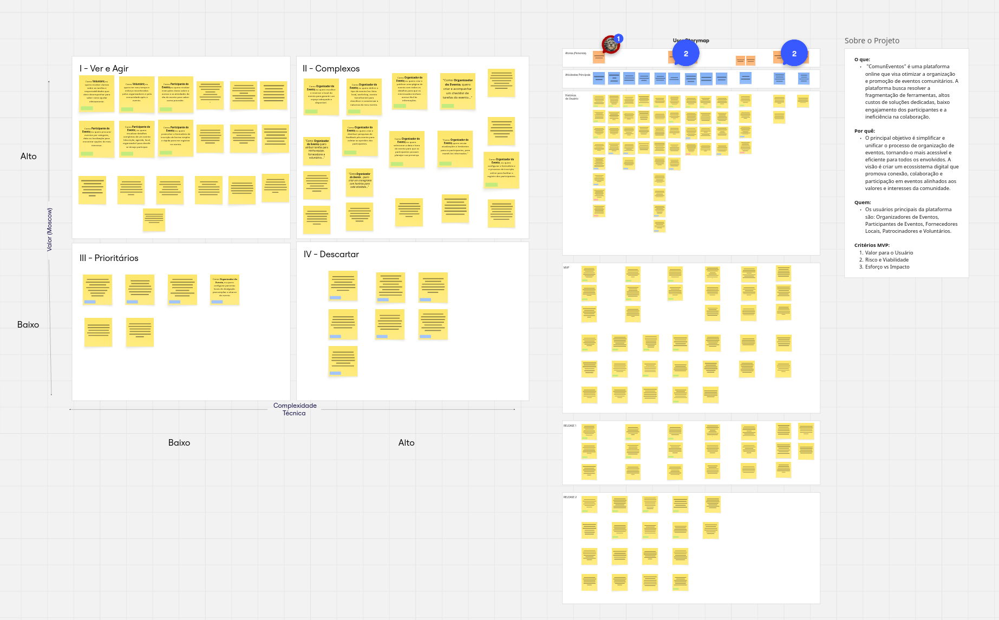
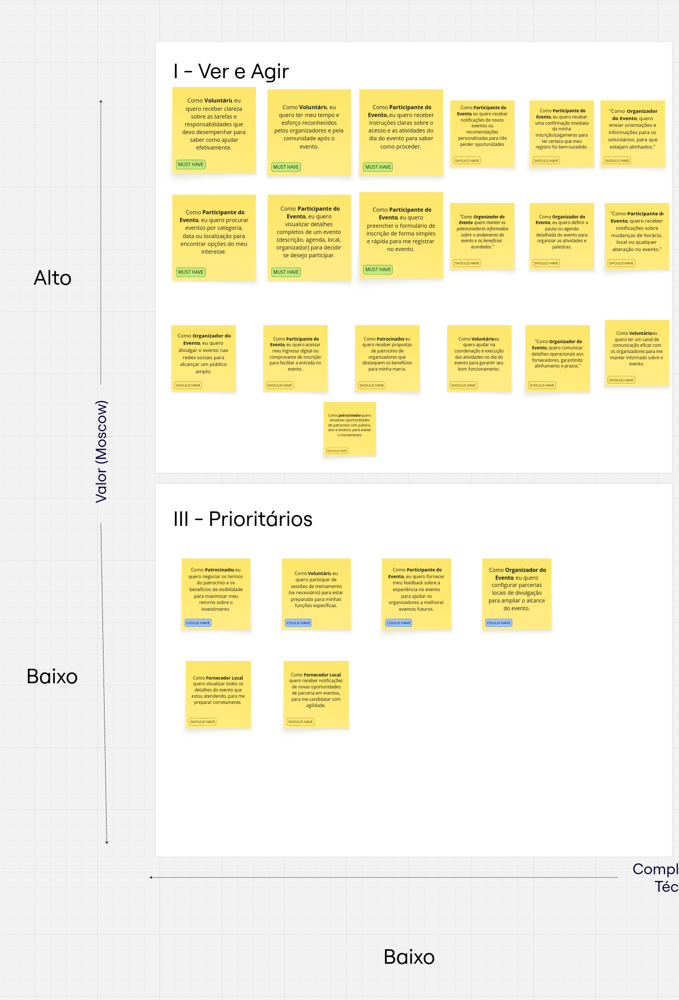
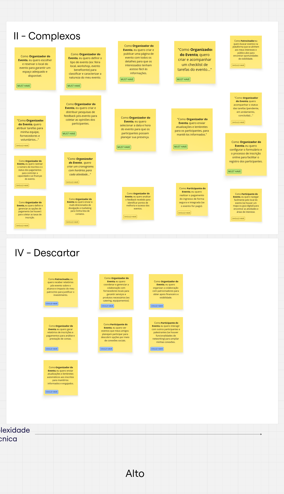
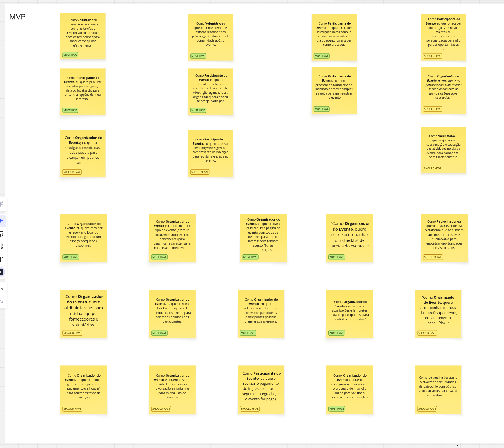
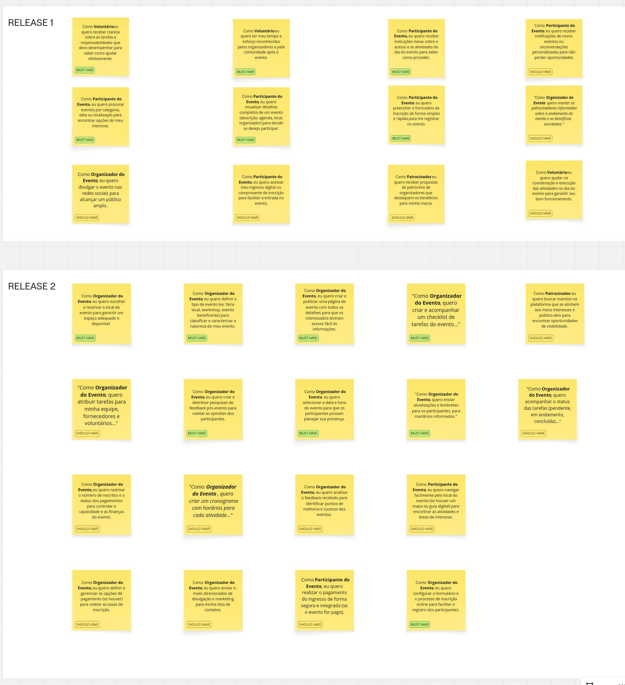 
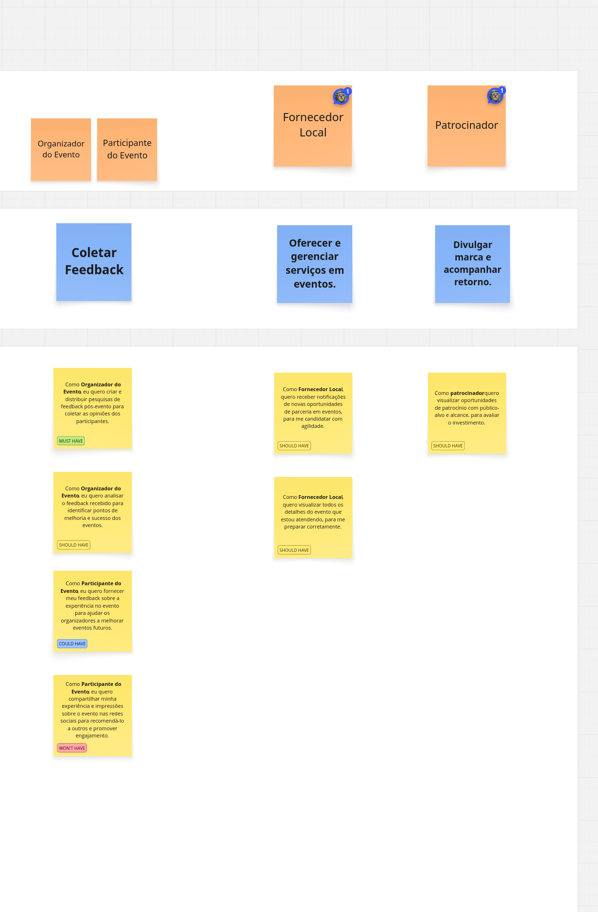
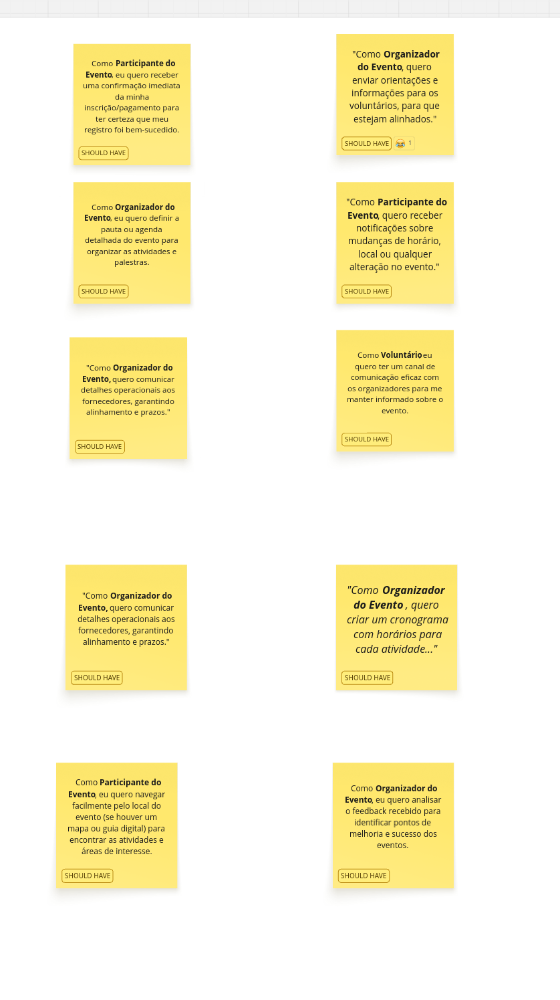
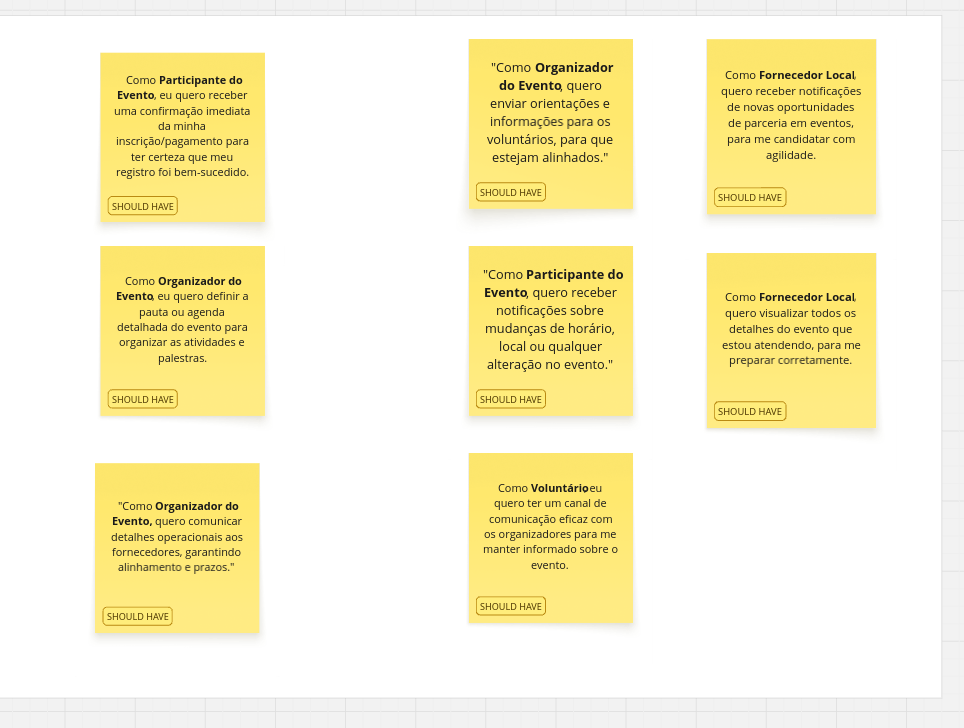 

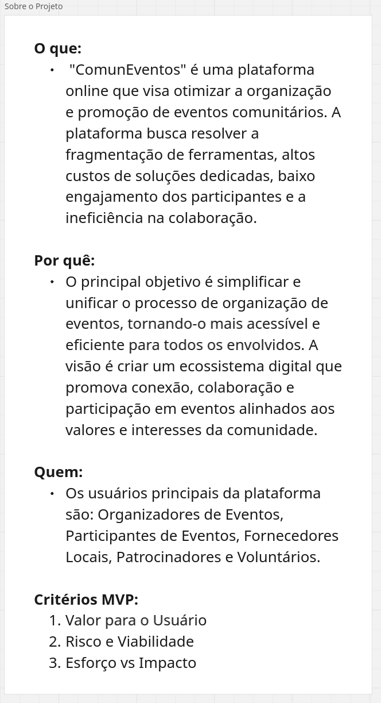

[Acesse o USM do Estudo de Caso completo no Miro](https://miro.com/app/board/uXjVInoXe-k=/)

### BDD - ComunEventos

#### Critérios de Aceitação Completos para User Stories do MVP

Este documento apresenta os critérios de aceitação completos para as 35 User Stories colocadas no MVP do sistema ComunEventos, seguindo o padrão BDD (Behavior-Driven Development).

[Acesse o documento completo no Google Docs](https://docs.google.com/document/d/1pbP3jJbLqM3W5ogY0hJ9ZvA8cGE3Kahbp5ONC6vERX0/edit?tab=t.0)

---

#### 1. Clareza sobre tarefas (Voluntário)
**Critérios de Aceitação:**
1) O voluntário consegue visualizar todas as tarefas atribuídas a ele
2) Cada tarefa exibe descrição completa e passo a passo de execução
3) O sistema mostra o status atual de cada tarefa (pendente/em andamento/concluído)
4) O voluntário consegue solicitar esclarecimentos quando informações estiverem incompletas

**Funcionalidade:** Clareza sobre tarefas e responsabilidades
Como Voluntário, Quero receber clareza sobre as tarefas e responsabilidades que devo desempenhar, Para saber como ajudar efetivamente

**Cenário:** Visualizar minhas tarefas atribuídas
```gherkin
Dado que estou logado como voluntário
Quando acesso a seção "Minhas Tarefas"
Então devo ver uma lista com:
- Descrição clara de cada tarefa
- Prazo para conclusão
- Responsável designado
- Status atual
```

---

#### 2. Busca de eventos (Participante)
**Critérios de Aceitação:**
1) O sistema filtra eventos por categoria selecionada
2) A busca por data retorna apenas eventos no período especificado
3) A busca por localização mostra eventos num raio de distância configurável
4) Os resultados exibem informações essenciais para decisão (data, local, preço)

**Funcionalidade:** Busca de eventos por categoria, data ou localização
Como Participante do Evento, Quero procurar eventos por categoria, data ou localização, Para encontrar opções do meu interesse

**Cenário:** Buscar eventos por categoria
```gherkin
Dado que estou na página de busca de eventos
Quando seleciono a categoria "Música"
Então o sistema deve exibir apenas eventos relacionados à categoria "Música"
E cada resultado deve mostrar:
- Nome do evento
- Data e horário
- Localização
- Breve descrição
```

---

#### 3. Divulgação em redes sociais (Organizador)
**Critérios de Aceitação:**
1) O sistema permite compartilhamento em pelo menos 3 redes sociais diferentes
2) Cada publicação inclui automaticamente imagem, descrição e link do evento
3) O organizador pode personalizar a mensagem para cada rede social
4) O sistema gera relatório de visualizações/cliques por plataforma

**Funcionalidade:** Divulgação do evento em redes sociais
Como Organizador do Evento, Quero divulgar o evento nas redes sociais, Para alcançar um público amplo

**Cenário:** Compartilhar evento automaticamente no Facebook
```gherkin
Dado que estou na página de gerenciamento do evento
Quando seleciono a opção "Compartilhar no Facebook"
E preencho uma mensagem personalizada
Então o sistema deve publicar o evento em minha página do Facebook
E incluir:
- Imagem do evento
- Data e local
- Link para inscrição
```

---

#### 4. Reserva de local (Organizador)
**Critérios de Aceitação:**
1) O sistema mostra apenas locais disponíveis para a data selecionada
2) Cada local exibe capacidade, infraestrutura e valor do aluguel
3) O organizador consegue reservar diretamente pelo sistema
4) O sistema envia confirmação por e-mail com termos de locação

**Funcionalidade:** Escolha e reserva do local do evento
Como Organizador do Evento, Quero escolher e reservar o local do evento, Para garantir um espaço adequado e disponível

**Cenário:** Buscar locais disponíveis por data
```gherkin
Dado que estou planejando um evento
Quando informo a data "15/11/2025"
E o número estimado de participantes "200 pessoas"
Então o sistema deve mostrar uma lista de locais disponíveis
Com as seguintes informações para cada um:
- Nome e endereço
- Capacidade máxima
- Valor do aluguel
- Estrutura oferecida
```

---

#### 5. Atribuição de tarefas (Organizador)
**Critérios de Aceitação:**
1) O organizador pode atribuir tarefas para equipe, fornecedores e voluntários
2) Cada tarefa aceita prazos, prioridades e descrições detalhadas
3) Os responsáveis recebem notificação imediata da atribuição
4) O sistema impede atribuição conflitante de mesma tarefa para múltiplas pessoas

**Funcionalidade:** Atribuição de tarefas para equipe e colaboradores
Como Organizador do Evento, Quero atribuir tarefas para minha equipe, fornecedores e voluntários, Para garantir a execução adequada de todas as atividades

**Cenário:** Atribuir tarefa para membro da equipe
```gherkin
Dado que estou na área de gestão de tarefas do evento
Quando seleciono "Nova Tarefa"
E preencho:
- Título: "Montagem do palco"
- Responsável: "Equipe de Logística"
- Prazo: "20/11/2025 às 14:00"
- Descrição detalhada
Então o sistema deve:
- Registrar a tarefa
- Notificar o responsável por e-mail
- Atualizar o quadro de tarefas
```

---

**Observação:** Este documento contém as 35 User Stories completas com critérios de aceitação e cenários BDD detalhados. As User Stories 6-35 incluem funcionalidades como: Gerenciamento de pagamentos, Reconhecimento de voluntários, Visualização de detalhes do evento, Ingresso digital, Criação de página do evento, Definição do tipo de evento, Pesquisas de feedback, Seleção de data/hora, E-mails de marketing, Pagamento seguro, Instruções para o evento, Formulário de inscrição, Checklist de tarefas, Atualizações para participantes, Configuração de inscrição, Notificações de eventos, Informações para patrocinadores, Coordenação no evento, Busca por patrocínios, Acompanhamento de status, Visualização de patrocínios, Confirmação de inscrição, Definição de agenda, Comunicação com fornecedores, Navegação no local, Orientação para voluntários, Notificações de mudanças, Comunicação com organizadores, Criação de cronograma e Análise de feedback.

Para visualizar todas as User Stories com seus critérios de aceitação e cenários BDD completos, acesse o documento no Google Docs através do link fornecido acima.

---

#### 6. Gerenciamento de pagamentos (Organizador)
**Critérios de Aceitação:**
1) O sistema aceita pelo menos 3 métodos de pagamento diferentes
2) Transações são processadas com segurança (certificado SSL)
3) O organizador pode definir diferentes categorias de ingressos
4) O sistema gera comprovante automático para cada pagamento

**Funcionalidade:** Gerenciamento de opções de pagamento
Como Organizador do Evento, Quero definir e gerenciar as opções de pagamento, Para coletar as taxas de inscrição de forma eficiente

**Cenário:** Configurar métodos de pagamento disponíveis
```gherkin
Dado que estou na área de configurações financeiras do evento
Quando acesso "Opções de Pagamento"
Então posso selecionar e configurar:
- Cartões de crédito (Visa, Mastercard, etc.)
- Pix
- Boleto bancário
- Pagamento presencial
E definir:
- Prazos para cada método
- Possibilidade de parcelamento
- Taxas adicionais (se aplicável)
```

---

#### 7. Reconhecimento de voluntários
**Critérios de Aceitação:**
1) O sistema emite certificado digital após conclusão do evento
2) O certificado inclui horas trabalhadas e atividades realizadas
3) Voluntários aparecem na página de agradecimentos do evento
4) O sistema permite compartilhamento em redes profissionais

**Funcionalidade:** Reconhecimento do tempo e esforço dos voluntários
Como Voluntário, Quero ter meu trabalho reconhecido pelos organizadores e comunidade, Para sentir que minha contribuição foi valorizada

**Cenário:** Receber certificado de participação
```gherkin
Dado que participei como voluntário no evento
Quando o evento é concluído
Então o sistema deve:
- Gerar automaticamente um certificado digital
- Incluir meu nome e horas voluntariadas
- Listar as atividades realizadas
- Permitir download em PDF compartilhável
```

---

#### 8. Visualização de detalhes do evento (Participante)
**Critérios de Aceitação:**
1) A página exibe descrição completa, agenda e localização com mapa
2) Informações do organizador são verificadas e confiáveis
3) O participante consegue visualizar fotos/vídeos de edições anteriores
4) A página possui seção clara de dúvidas frequentes

**Funcionalidade:** Visualização completa de detalhes do evento
Como Participante do Evento, Quero visualizar detalhes completos de um evento, Para decidir se desejo participar

**Cenário:** Acessar página completa do evento
```gherkin
Dado que encontrei um evento de meu interesse
Quando acesso sua página dedicada
Então devo visualizar:
- Descrição completa e objetivos
- Agenda detalhada com horários
- Localização com mapa
- Informações do organizador
- Fotos/vídeos de edições anteriores
```

---

#### 9. Ingresso digital (Participante)
**Critérios de Aceitação:**
1) O ingresso contém QR code válido para entrada
2) O participante consegue acessar pelo celular sem necessidade de impressão
3) O comprovante exibe dados essenciais (nome, evento, data, local)
4) O sistema permite reenvio do ingresso por e-mail quando solicitado

**Funcionalidade:** Ingresso digital do participante
Como Participante do Evento, Quero acessar meu ingresso digital, Para facilitar a entrada no evento

**Cenário:** Visualizar comprovante de inscrição
```gherkin
Dado que me inscrevi em um evento
Quando acesso minha área do participante
Então posso:
- Visualizar ingresso com QR code
- Baixar em formato PDF
- Adicionar à carteira digital (Google/Apple Wallet)
- Reenviar para meu e-mail
```

---

#### 10. Criação de página do evento (Organizador)
**Critérios de Aceitação:**
1) O editor permite formatação rica (texto, imagens, vídeos)
2) O sistema valida campos obrigatórios antes da publicação
3) A URL gerada é amigável e compartilhável
4) O organizador pode fazer edições após publicação

**Funcionalidade:** Publicação da página do evento
Como Organizador do Evento, Quero criar e publicar uma página completa, Para divulgar todas as informações

**Cenário:** Publicar página com sucesso
```gherkin
Dado que completei todas as seções obrigatórias
Quando clico em "Publicar Evento"
Então o sistema deve:
- Validar informações completas
- Gerar URL amigável
- Disponibilizar página publicamente
- Permitir edições posteriores
```

---

#### 11. Definição do tipo de evento (Organizador)
**Critérios de Aceitação:**
1) O sistema oferece pelo menos 5 categorias principais de eventos
2) A seleção altera configurações padrão apropriadas ao tipo
3) O tipo aparece claramente na página pública do evento
4) O organizador pode criar subtipos personalizados quando necessário

**Funcionalidade:** Classificação do tipo de evento
Como Organizador do Evento, Quero definir o tipo de evento, Para classificar sua natureza

**Cenário:** Selecionar categoria principal
```gherkin
Dado que estou criando um novo evento
Quando seleciono o tipo de evento
Então posso escolher entre opções como:
- Feira local
- Workshop educacional
- Evento beneficente
- Conferência profissional
E o sistema deve sugerir configurações padrão conforme o tipo
```

---

#### 12. Pesquisas de feedback (Organizador)
**Critérios de Aceitação:**
1) O sistema envia pesquisa automaticamente após o evento
2) As perguntas podem ser personalizadas pelo organizador
3) Os resultados são compilados em relatórios analíticos
4) O sistema destaca comentários relevantes automaticamente

**Funcionalidade:** Coleta de feedback pós-evento
Como Organizador do Evento, Quero criar e distribuir pesquisas, Para coletar opiniões dos participantes

**Cenário:** Enviar pesquisa automatizada
```gherkin
Dado que o evento foi concluído
Quando ativo a pesquisa de satisfação
Então o sistema deve:
- Enviar e-mail automático aos participantes
- Coletar respostas de forma anônima
- Gerar relatório consolidado
- Alertar sobre comentários importantes
```

---

#### 13. Seleção de data/hora (Organizador)
**Critérios de Aceitação:**
1) O calendário evita marcação em feriados nacionais
2) O sistema alerta sobre conflitos de horário
3) Mudanças na programação disparam notificações
4) O organizador pode definir múltiplos dias para eventos prolongados

**Funcionalidade:** Configuração de data do evento
Como Organizador do Evento, Quero selecionar data e hora, Para que participantes possam planejar

**Cenário:** Definir período principal
```gherkin
Dado que estou configurando o evento
Quando insiro:
- Data de início: 15/11/2025
- Hora: 14:00
- Duração: 3 horas
Então o sistema deve:
- Verificar conflitos com feriados
- Sugerir horários alternativos se necessário
- Atualizar automaticamente todas as comunicações
```

---

#### 14. E-mails de marketing (Organizador)
**Critérios de Aceitação:**
1) O sistema permite segmentação da lista de contatos
2) Os e-mails são responsivos (mobile-friendly)
3) O organizador visualiza taxa de abertura/clique
4) O sistema impede envios em massa não autorizados

**Funcionalidade:** Campanhas de e-mail marketing
Como Organizador do Evento, Quero enviar e-mails direcionados, Para divulgar meu evento

**Cenário:** Enviar convite personalizado
```gherkin
Dado que importei minha lista de contatos
Quando crio uma campanha de divulgação
Então posso:
- Segmentar por interesses
- Personalizar mensagens
- Agendar envios
- Acompanhar taxas de abertura
```

---

#### 15. Pagamento seguro (Participante)
**Critérios de Aceitação:**
1) Dados financeiros são criptografados
2) O sistema valida informações antes do processamento
3) Transações recusadas explicam o motivo
4) O participante recebe comprovante imediato

**Funcionalidade:** Processamento de pagamentos
Como Participante do Evento, Quero pagar meu ingresso com segurança, Para garantir minha participação

**Cenário:** Finalizar compra com cartão
```gherkin
Dado que selecionei um evento pago
Quando preencho os dados do cartão
Então o sistema deve:
- Validar informações em tempo real
- Processar pagamento criptografado
- Enviar comprovante imediato
- Oferecer garantia contra fraudes
```

---

#### 16. Instruções para o evento (Participante)
**Critérios de Aceitação:**
1) As informações chegam pelo menos 24h antes
2) O material inclui mapa, programação e contatos importantes
3) O participante pode acessar offline quando necessário
4) Há versão resumida para consulta rápida no local

**Funcionalidade:** Guia do participante
Como Participante do Evento, Quero receber instruções claras, Para me preparar adequadamente

**Cenário:** Acessar informações do dia
```gherkin
Dado que minha inscrição foi confirmada
Quando faltam 3 dias para o evento
Então recebo e-mail com:
- Programação detalhada
- Mapa de acesso
- Regras de conduta
- Contatos de emergência
```

---

#### 17. Formulário de inscrição (Participante)
**Critérios de Aceitação:**
1) O formulário é completável em menos de 2 minutos
2) Campos obrigatórios são claramente marcados
3) O sistema sugere autocompletar quando possível
4) Dados são salvos automaticamente durante o preenchimento

**Funcionalidade:** Inscrição rápida em eventos
Como Participante do Evento, Quero preencher formulários simples, Para me registrar rapidamente

**Cenário:** Completar inscrição em 2 minutos
```gherkin
Dado que encontrei um evento interessante
Quando acesso o formulário de inscrição
Então posso:
- Preencher campos essenciais apenas
- Usar autopreenchimento
- Salvar dados para próximos eventos
- Receber confirmação imediata
```

---

#### 18. Checklist de tarefas (Organizador)
**Critérios de Aceitação:**
1) O sistema permite criação de tarefas recorrentes
2) Cada item aceita anexos e observações
3) O progresso geral é exibido graficamente
4) Lembretes automáticos são enviados conforme configuração

**Funcionalidade:** Gerenciamento de checklist
Como Organizador do Evento, Quero criar e acompanhar um checklist, Para garantir nada seja esquecido

**Cenário:** Adicionar nova tarefa ao checklist
```gherkin
Dado que estou planejando o evento
Quando adiciono uma tarefa:
- Título: "Contratar buffet"
- Responsável: "Maria"
- Prazo: "10/11/2025"
Então o sistema deve:
- Incluir no checklist geral
- Notificar o responsável
- Atualizar status como "Pendente"
```

---

#### 19. Atualizações para participantes (Organizador)
**Critérios de Aceitação:**
1) Mensagens chegam por e-mail e notificação no app
2) O organizador sabe quantos receberam a comunicação
3) Participantes podem optar por não receber determinados tipos
4) Urgências são destacadas adequadamente

**Funcionalidade:** Comunicação com participantes
Como Organizador do Evento, Quero enviar atualizações e lembretes, Para manter todos informados

**Cenário:** Enviar lembrete pré-evento
```gherkin
Dado que o evento ocorrerá em 3 dias
Quando seleciono "Enviar lembrete"
E escrevo a mensagem
Então o sistema deve:
- Enviar para todos inscritos
- Incluir informações essenciais
- Permitir personalização
- Gerar relatório de entregas
```

---

#### 20. Configuração de inscrição (Organizador)
**Critérios de Aceitação:**
1) O organizador define campos obrigatórios e opcionais
2) O sistema valida formatos de e-mail/telefone
3) Dados podem ser exportados para planilha
4) Há pré-visualização do formulário antes da publicação

**Funcionalidade:** Personalização de formulário
Como Organizador do Evento, Quero configurar o formulário, Para facilitar o registro

**Cenário:** Criar formulário personalizado
```gherkin
Dado que estou na seção de inscrições
Quando adiciono campos:
- Campos obrigatórios: Nome, Email
- Campos opcionais: Empresa, Cargo
- Perguntas específicas do evento
Então o sistema deve:
- Salvar o template
- Mostrar pré-visualização
- Permitir testes antes da publicação
```

---

#### 21. Notificações de eventos (Participante)
**Critérios de Aceitação:**
1) As recomendações são baseadas em histórico de interesses
2) O usuário controla frequência e tipos de notificações
3) Cada alerta contém informações essenciais para decisão
4) Há opção para desativar recomendações específicas

**Funcionalidade:** Notificações personalizadas
Como Participante do Evento, Quero receber recomendações, Para não perder oportunidades

**Cenário:** Receber sugestões relevantes
```gherkin
Dado que participei de eventos anteriores
Quando há novos eventos similares
Então o sistema deve:
- Enviar notificação personalizada
- Basear em meus interesses
- Permitir configuração de frequência
- Oferecer link direto para inscrição
```

---

#### 22. Informações para patrocinadores (Organizador)
**Critérios de Aceitação:**
1) Relatórios incluem métricas de público atualizadas
2) O sistema gera comprovantes de visibilidade (prints, menções)
3) Patrocinadores podem acessar portal com dados exclusivos
4) Alertas automáticos são enviados quando metas são atingidas

**Funcionalidade:** Relacionamento com patrocinadores
Como Organizador do Evento, Quero manter patrocinadores informados, Para honrar acordos estabelecidos

**Cenário:** Enviar relatório de alcance
```gherkin
Dado que o evento está em andamento
Quando preparo atualização para patrocinadores
Então o sistema deve:
- Gerar métricas de público
- Incluir fotos/menções
- Permitir envio segmentado
- Oferecer template profissional
```

---

#### 23. Coordenação no evento (Voluntário)
**Critérios de Aceitação:**
1) O voluntário acessa sua lista de tarefas específicas
2) Há mapa com postos e estações de trabalho
3) Contatos de emergência são facilmente acessíveis
4) O sistema registra check-in/check-out no local

**Funcionalidade:** Atuação no dia do evento
Como Voluntário, Quero ajudar na execução, Para garantir bom funcionamento

**Cenário:** Receber atribuições claras
```gherkin
Dado que sou voluntário credenciado
Quando acesso minha área no dia
Então devo ver:
- Minhas tarefas específicas
- Horários de atuação
- Ponto de encontro
- Contato do supervisor
```

---

#### 24. Busca por patrocínios (Patrocinador)
**Critérios de Aceitação:**
1) Filtros por público-alvo retornam resultados precisos
2) Cada evento mostra dados demográficos verificados
3) O sistema calcula ROI estimado para diferentes níveis
4) Há canal direto com organizadores para negociação

**Funcionalidade:** Busca de eventos para patrocínio
Como Patrocinador, Quero encontrar eventos relevantes, Para maximizar meu investimento

**Cenário:** Filtrar eventos por público-alvo
```gherkin
Dado que estou buscando oportunidades
Quando aplico filtros:
- Público: "Profissionais de TI"
- Região: "Sudeste"
- Tamanho: "500+ participantes"
Então o sistema deve mostrar:
- Eventos compatíveis
- Dados demográficos
- Opções de patrocínio
- ROI estimado
```

---

#### 25. Acompanhamento de status (Organizador)
**Critérios de Aceitação:**
1) O painel mostra porcentagem de conclusão geral
2) Cada tarefa exibe histórico de alterações
3) Alertas são disparados para atrasos
4) O sistema permite reatribuição rápida quando necessário

**Funcionalidade:** Monitoramento de progresso
Como Organizador do Evento, Quero acompanhar status de tarefas, Para gerenciar melhor o evento

**Cenário:** Atualizar status de tarefa
```gherkin
Dado que uma tarefa está em andamento
Quando mudo seu status para "Concluído"
Então o sistema deve:
- Atualizar em tempo real
- Notificar interessados
- Registrar data/hora
- Atualizar métricas de progresso
```

---

#### 26. Visualização de patrocínios (Patrocinador)
**Critérios de Aceitação:**
1) Oportunidades são classificadas por relevância
2) Dados de público incluem faixa etária, gênero e interesses
3) Benefícios são detalhados por nível de investimento
4) Há exemplos de branding em edições anteriores

**Funcionalidade:** Análise de patrocínios
Como Patrocinador, Quero avaliar oportunidades, Para tomar decisões estratégicas

**Cenário:** Visualizar dados de público
```gherkin
Dado que encontrei um evento interessante
Quando acesso os detalhes de patrocínio
Então devo ver:
- Perfil demográfico
- Alcance estimado
- Mídias incluídas
- Investimento necessário
```

---

#### 27. Confirmação de inscrição (Participante)
**Critérios de Aceitação:**
1) O e-mail chega em até 2 minutos após conclusão
2) O comprovante é gerado em formato PDF anexado
3) Há link para adicionar ao calendário pessoal
4) Instruções para cancelamento são claramente exibidas

**Funcionalidade:** Confirmação imediata
Como Participante do Evento, Quero receber confirmação, Para ter certeza do meu registro

**Cenário:** Confirmação automática
```gherkin
Dado que completei minha inscrição
Quando finalizo o processo
Então o sistema deve:
- Enviar e-mail imediato
- Gerar comprovante digital
- Incluir resumo das informações
- Oferecer adicionar ao calendário
```

---

#### 28. Definição de agenda (Organizador)
**Critérios de Aceitação:**
1) O sistema alerta sobre sobreposições de horário
2) Permite arrastar e soltar para reorganização
3) Gera versões pública e interna automaticamente
4) Calcula recursos necessários por período

**Funcionalidade:** Criação de programação
Como Organizador do Evento, Quero definir a agenda detalhada, Para organizar as atividades

**Cenário:** Criar cronograma de palestras
```gherkin
Dado que estou na seção de programação
Quando adiciono uma atividade:
- Título: "Palestra Inovação"
- Horário: "10:00-11:30"
- Palestrante: "Dra. Silva"
- Local: "Auditório Principal"
Então o sistema deve:
- Mostrar visualização temporal
- Alertar sobre conflitos
- Gerar versão para impressão
```

---

#### 29. Comunicação com fornecedores (Organizador)
**Critérios de Aceitação:**
1) O sistema registra confirmação de recebimento
2) Prazos são destacados automaticamente
3) Permite anexar contratos e especificações técnicas
4) Mantém histórico completo de conversas

**Funcionalidade:** Alinhamento com fornecedores
Como Organizador do Evento, Quero comunicar detalhes operacionais, Para garantir cumprimento de prazos

**Cenário:** Enviar briefing para fornecedor
```gherkin
Dado que tenho contratado um serviço
Quando acesso o módulo de fornecedores
Então posso:
- Enviar especificações técnicas
- Anexar contratos
- Definir checkpoints
- Registrar entregas
```

---

#### 30. Navegação no local (Participante)
**Critérios de Aceitação:**
1) O mapa funciona offline após primeiro acesso
2) Mostra localização em tempo real no venue
3) Inclui rotas acessíveis para cadeirantes
4) Permite busca por atividade ou serviço (banheiro, foodtruck)

**Funcionalidade:** Orientação espacial
Como Participante do Evento, Quero navegar facilmente, Para encontrar atividades

**Cenário:** Usar mapa interativo
```gherkin
Dado que estou no local do evento
Quando acesso o mapa digital
Então posso:
- Ver minha localização atual
- Buscar por atividades
- Ver rotas entre espaços
- Salvar locais favoritos
```

---

#### 31. Orientação para voluntários (Organizador)
**Critérios de Aceitação:**
1) Materiais estão disponíveis em formato mobile
2) Inclui FAQ dinâmico atualizável
3) Voluntários confirmam entendimento digitalmente
4) Há canal dedicado para dúvidas operacionais

**Funcionalidade:** Direcionamento de voluntários
Como Organizador do Evento, Quero enviar orientações, Para manter todos alinhados

**Cenário:** Enviar guia completo
```gherkin
Dado que faltam 2 dias para o evento
Quando preparo o material para voluntários
Então o sistema deve permitir:
- Envio em massa
- Confirmação de recebimento
- Anexar documentos importantes
- Incluir FAQ atualizado
```

---

#### 32. Notificações de mudanças (Participante)
**Critérios de Aceitação:**
1) Alertas chegam por múltiplos canais simultaneamente
2) Mudanças são destacadas em vermelho/negrito
3) Oferece opções alternativas quando aplicável
4) O participante pode confirmar recebimento

**Funcionalidade:** Alertas de alterações
Como Participante do Evento, Quero ser informado sobre mudanças, Para me adaptar a tempo

**Cenário:** Receber aviso de mudança
```gherkin
Dado que estou inscrito no evento
Quando há alteração na programação
Então devo receber:
- Notificação imediata
- Detalhes da mudança
- Impacto na minha agenda
- Opções alternativas
```

---

#### 33. Comunicação com organizadores (Voluntário)
**Critérios de Aceitação:**
1) Mensagens têm tempo máximo de resposta de 2 horas
2) Permite anexar fotos e documentos
3) Organiza conversas por evento/tarefa
4) Diferencia comunicações urgentes de rotina

**Funcionalidade:** Canal de comunicação
Como Voluntário, Quero me comunicar eficazmente, Para esclarecer dúvidas

**Cenário:** Enviar mensagem rápida
```gherkin
Dado que tenho uma dúvida
Quando acesso o chat do evento
Então posso:
- Enviar mensagem direta
- Anexar fotos se necessário
- Receber resposta em até 2h
- Ver histórico de conversas
```

---

#### 34. Criação de cronograma (Organizador)
**Critérios de Aceitação:**
1) Blocos de tempo são customizáveis
2) Alertas sobre horários não preenchidos
3) Calcula recursos necessários por período
4) Permite versões alternativas para contingência

**Funcionalidade:** Planejamento temporal
Como Organizador do Evento, Quero criar um cronograma, Para organizar todas as atividades

**Cenário:** Definir horários precisos
```gherkin
Dado que estou na etapa de programação
Quando aloco atividades:
- "Credenciamento" 08:00-09:00
- "Cerimônia Abertura" 09:00-09:30
- "Coffee Break" 10:45-11:15
Então o sistema deve:
- Mostrar linha do tempo visual
- Alertar sobre sobreposições
- Calcular tempo total
```

---

#### 35. Análise de feedback (Organizador)
**Critérios de Aceitação:**
1) Relatórios são gerados automaticamente
2) Identifica tendências em comentários livres
3) Permite filtros por tipo de participante
4) Sugere ações de melhoria baseadas em dados

**Funcionalidade:** Processamento de avaliações
Como Organizador do Evento, Quero analisar feedback, Para melhorar futuros eventos

**Cenário:** Gerar relatório consolidado
```gherkin
Dado que recebi avaliações
Quando acesso a análise de feedback
Então o sistema deve mostrar:
- Nota média geral
- Gráficos por categoria
- Comentários relevantes
- Sugestões de melhoria
```

[Acesse o documento completo no Google Docs](https://docs.google.com/document/d/1pbP3jJbLqM3W5ogY0hJ9ZvA8cGE3Kahbp5ONC6vERX0/edit?tab=t.0)