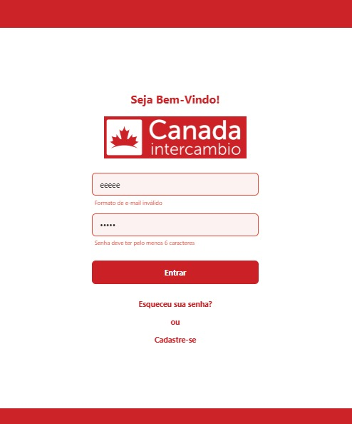

# Evidências de Execução do Processo de ESW e ER

## ESW

### Protótipo de Interface

**Tipo de Evidência:** Protótipo de Design

**Ferramenta:** Figma

**Descrição:** Protótipo interativo desenvolvido para visualização das interfaces do sistema, permitindo validação das telas e fluxos de navegação com o cliente.

<iframe style="border: 1px solid rgba(0, 0, 0, 0.1);" width="800" height="450" src="https://embed.figma.com/design/zCA2mAV88ytsBqTJLOOeEJ/Untitled?node-id=0-1&embed-host=share" allowfullscreen></iframe>

[Acesse o protótipo interativo no Figma](https://www.figma.com/proto/zCA2mAV88ytsBqTJLOOeEJ/Untitled?node-id=0-1&t=ITPUwvZnmHHfBJBm-1)

**Relevância para ESW:**
- Validação de requisitos através de interface visual
- Comunicação efetiva com stakeholders
- Definição de padrões de design e usabilidade
- Base para desenvolvimento das funcionalidades

---

### Setup de Ambiente de Desenvolvimento

**Tipo de Evidência:** Configuração de Ambiente

**Arquivo:** `/scripts/dev.sh`

**Descrição:** Script automatizado para configuração e execução do ambiente de desenvolvimento do projeto, incluindo backend, frontend e banco de dados.

**Funcionalidades do Script:**
- Configuração automática do ambiente Docker
- Inicialização dos serviços backend e frontend
- Configuração do banco de dados
- Comandos para desenvolvimento e debugging
- Logging estruturado com cores
- Validação de dependências

**Relevância para ESW:**
- Padronização do ambiente de desenvolvimento
- Redução de tempo de setup para novos desenvolvedores
- Automatização de processos repetitivos
- Garantia de consistência entre ambientes
- Facilitação da colaboração em equipe

---

### Estrutura do Banco de Dados via Prisma ORM

**Tipo de Evidência:** Modelagem de Dados

**Arquivo:** `/backend/prisma/schema.prisma`

**Descrição:** Estrutura do banco de dados criada via Prisma ORM com PostgreSQL, incluindo as tabelas principais: User, Visitante, Intercambista, Admin, Program, Quiz, QuizQuestion e QuizResult, com relacionamentos e índices otimizados.

**Relevância para ESW:**
- Uso de ORM moderno para type-safety
- Estrutura normalizada e escalável
- Facilidade de manutenção e migração

## ER

#### Evidência 1

**Documento:** Ata de Reunião – 02/05/2025

**Tipo de Evidência:** Documental

**Local:** Teams

**Horário:** 18h16 às 19h13

**Participantes:** Thais, Fábio, Dann, Marina Galdi, Henrique, Ana Elisa, Luiz Henrique

**Pontos Relacionados ao Processo de Engenharia de Requisitos:**

- Definição da necessidade de especificar os dados utilizados
- Estabelecimento de métrica: atendimentos concluídos
- Levantamento de problemas com templates e comunicação com clientes
- Propostas com quizzes gamificados, vídeos e personalização da experiência
- Confirmação de alinhamento com o cliente quanto à documentação e objetivo
- Apresentação de requisitos funcionais por Dann
- Solicitação de sugestões sobre os requisitos (Marina)
- Sugestões de funcionalidades: FAQ, promoções, quiz, personalização por perfil

**Encaminhamentos:**

- Solicitação de documentos: FAQ, identidade visual, dados por filial
- Reformulação dos requisitos
- Montagem de template
- Criação de grupo e discussão sobre CSM
- Propostas para humanização, CMS mobile e diferentes perfis no app

---

#### Evidência 2

**Documento:** Ata de Reunião – 19/05/2025

**Tipo de Evidência:** Documental

**Local:** Teams

**Participantes:** Marina Agostini Galdi, Henrique Targino, Thais Rodrigues, Renan, Dannyeclisson, Ana, Felipe, Luiz, Fabio

**Pontos Relacionados ao Processo de Engenharia de Requisitos:**

- Apresentação de protótipo com funcionalidades: cronograma, contagem regressiva, homepage, upload de documentos
- Discussão sobre logo e identidade visual (uso do nome completo da marca)
- Decisão sobre padronização visual com base no site atual

**Encaminhamentos:**

- Atualizar o protótipo com nome completo da marca
- Manter padronização visual
- Prosseguir com desenvolvimento baseado no protótipo apresentado

---

#### Evidência 3

**Documento:** Ata de Reunião – 06/06/2025

**Tipo de Evidência:** Documental

**Local:** Teams

**Horário:** 16h00 às 17h00

**Participantes:** Marina Agostini Galdi, Thais Rodrigues, Ana Elisa Marques Martins Ramos, Fabio, Henrique Targino, Dannyeclisson, Renan

**Pontos Relacionados ao Processo de Engenharia de Requisitos:**

- Apresentação da tela inicial e proposta de transição suave no app
- Discussão sobre a tela de promoções: decisão de adiar esse recurso
- Priorização: foco inicial na área administrativa (cadastro/edição de programas); módulo do intercambista adiado
- Definição de métricas: uso inicial de dados da unidade de Brasília

**Encaminhamentos:**

- Promoções postergadas
- Início do desenvolvimento do painel administrativo
- Consolidar métricas com dados de Brasília
- Continuidade de comunicação via grupo de mensagens

---

#### Funcionalidades implementadas

**Login**

**Navegação pelos programas**

## Histórico de Alterações

| Data | Versão | Autor | Descrição das Alterações |
|------|--------|-------|---------------------------|
| 24/06/2025 | 1.0 | Equipe de Desenvolvimento | Criação inicial do documento com evidências de ESW e ER |
| 24/06/2025 | 1.1 | Equipe de Desenvolvimento | Adição do protótipo de interface do Figma |
| 24/06/2025 | 1.2 | Equipe de Desenvolvimento | Inclusão da evidência de setup de ambiente de desenvolvimento |
| 24/06/2025 | 1.3 | Equipe de Desenvolvimento | Adição da estrutura do banco de dados via Prisma ORM |
| 24/06/2025 | 1.4 | Equipe de Desenvolvimento | Inclusão das três evidências documentais de ER das reuniões |
| 14/07/2025 | 1.5 | Equipe de Desenvolvimento | Inclusão de algumas funcionalidades implementadas |

