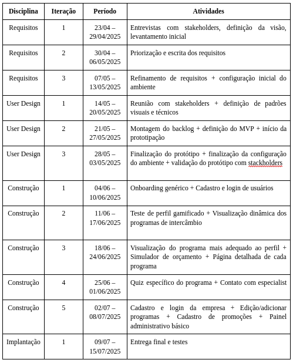

# Resolução das Issues
## Entrega 1

### Issue1:

### Como resolvemos:

>Adiconamos o link para o nosso GitPages no README.<

### Issue relacionada:
[Link para a issue no GitHub](https://github.com/mdsreq-fga-unb/2025.1-T02-CanadaIntercambio/issues/1)

---

### Issue2:

### Como resolvemos:

>Adiconamos o nosso diagrama de Causa e Efeito no GitPages.<

### Issue relacionada:
[Link para a issue no GitHub](https://github.com/mdsreq-fga-unb/2025.1-T02-CanadaIntercambio/issues/2)

---

### Issue3:

### Como resolvemos:

>Mudamos a forma como expressamos, para tirar da subjetividade. Além disso, solicitamos ao cliente que fizesse um levantamento das métricas relacionadas aos atendimentos para que, após a implementação do aplicativo, a gente possa verificar a efetividade dele no problema.<

### Issue relacionada:
[Link para a issue no GitHub](https://github.com/mdsreq-fga-unb/2025.1-T02-CanadaIntercambio/issues/3)

---

### Issue4:

### Como resolvemos:

>Optamos por alterar o ciclo de vida e o processo escolhido por nós. Passamos para um ciclo iterativo e incremental e para o RAD puro.<

### Issue relacionada:
[Link para a issue no GitHub](https://github.com/mdsreq-fga-unb/2025.1-T02-CanadaIntercambio/issues/4)

---

### Issue5:

### Como resolvemos:

>Ajustamos o nosso cronograma para se adaptar a mudança na estratégia de ESW.<

### Issue relacionada:
[Link para a issue no GitHub](https://github.com/mdsreq-fga-unb/2025.1-T02-CanadaIntercambio/issues/5)

---

### Issue6:

### Como resolvemos:

>Referenciamos a todos na parte de Engenharia de Requisitos.<

### Issue relacionada:
[Link para a issue no GitHub](https://github.com/mdsreq-fga-unb/2025.1-T02-CanadaIntercambio/issues/6)

---

### Issue7:

### Como resolvemos:

>Arrumamos o erro da reprodução do vídeo.<

### Issue relacionada:
[Link para a issue no GitHub](https://github.com/mdsreq-fga-unb/2025.1-T02-CanadaIntercambio/issues/7)

