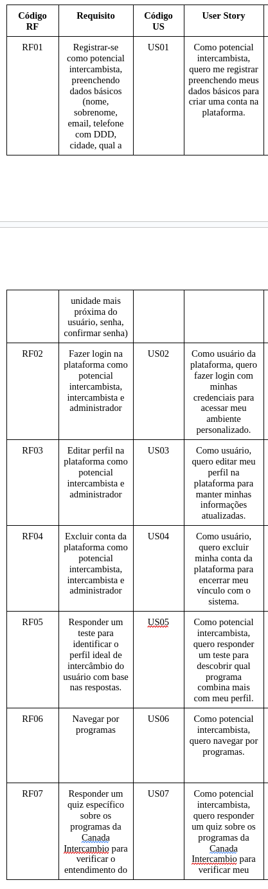
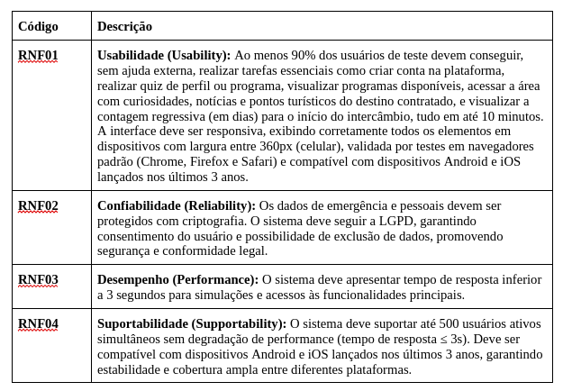

# Retrospectiva do projeto

## Visão do Produto

Durante toda a execução do projeto *CanadaWay*, a visão de produto permaneceu estável e alinhada com os objetivos iniciais. O problema identificado desde o início — a dificuldade enfrentada por potenciais intercambistas em encontrar informações confiáveis, simular custos e tomar decisões informadas — continuou sendo o foco principal do desenvolvimento.

O propósito do CanadaWay sempre foi **melhorar a experiência do usuário** na jornada de planejamento e contratação de um intercâmbio. Isso se traduz em funcionalidades voltadas à autonomia do usuário, personalização da experiência, e suporte contínuo antes e durante o processo de mobilidade.

Os objetivos estratégicos definidos inicialmente também permaneceram os mesmos:

- **Aumentar a captação de clientes** por meio de uma plataforma interativa e acessível;
- **Reduzir a sobrecarga de atendimentos repetitivos** com funcionalidades autoexplicativas e simuladores inteligentes;
- **Oferecer apoio prático e informativo** aos intercambistas durante todo o processo.

A consistência dessa visão permitiu que todas as decisões de projeto fossem direcionadas com clareza, garantindo foco, coesão e alinhamento com os usuários e stakeholders.

---

## Proposta de solução

A proposta de solução inicial do projeto *CanadaWay* foi mantida em sua essência: desenvolver uma plataforma digital que auxilie potenciais intercambistas na tomada de decisão, com base em perfis personalizados, simulações de orçamento e acesso a informações relevantes.

Contudo, ao longo do desenvolvimento, alguns ajustes foram realizados, com o objetivo de manter o foco na experiência do usuário e na viabilidade técnica da entrega:

- **Remoção dos filtros avançados e do chatbot**: essas funcionalidades estavam previstas inicialmente, mas foram retiradas com base em *validação direta com o cliente*. A análise identificou que os filtros tornariam a interface excessivamente complexa, e o chatbot exigiria um esforço técnico desproporcional ao valor entregue nesta fase do projeto. Ambas as decisões foram consensuais e registradas.
  
- **Adição do Prisma ORM**: para a camada de persistência de dados, foi integrada a ferramenta PrismaORM, que otimizou o acesso ao banco de dados e melhorou a manutenção e escalabilidade da aplicação. Essa alteração técnica foi decidida em conjunto com a equipe de desenvolvimento, visando maior robustez no backend e agilidade nas iterações.

Essas mudanças foram implementadas sem comprometer os objetivos centrais do projeto, mas sim refinando a proposta de solução com base em validação contínua e foco na entrega de valor dentro dos recursos disponíveis.

---

## Eng. de Software

A abordagem escolhida por nós foi a Ágil, o ciclo de vida escolhido foi o Iterativo e Incremental e o processo foi o RAD isolado (Rapid Application Development). Abaixo segue como foi implementado o método de engenharia de software escolhido ao longo do projeto e o que não foi.

### Versões do protótipo

O **Histórico de versões do protótipo** é uma forma de verificar que o ciclo de vida Iterativa e Incremental foi implementada.

### Registros das reuniões por ciclos

Os **Registros de reuniões e mensagens de organização dos ciclos** é uma forma de verificar que a abordagem Ágil foi implementada.

### Protótipo Final

O **Protótipo final e sua validação com o stakeholder** é uma forma de verificar que o processo RAD foi implementado.

---

## Eng. de Requisitos

Durante a execução do projeto *CanadaWay*, a equipe aplicou de forma consistente todas as principais atividades e técnicas de Engenharia de Requisitos (ER), alinhadas à abordagem iterativa e incremental do processo RAD (Rapid Application Development). 

A ER foi conduzida como um processo contínuo e integrado entre as fases, permitindo revisões, validações e ajustes com base em feedbacks reais, o que foi essencial para garantir que as funcionalidades desenvolvidas estivessem alinhadas às necessidades dos usuários e do cliente.

### Atividades implementadas com sucesso:

- **Elicitação e Descoberta:** Foram realizadas entrevistas, brainstormings e análises de concorrentes e documentos para levantar requisitos reais e relevantes. 

- **Análise e Consenso:** Os requisitos passaram por momentos de discussão e alinhamento, onde restrições, prioridades e possíveis ambiguidades foram tratadas de forma colaborativa.

- **Declaração e Representação:** A documentação foi organizada por meio de histórias de usuário, critérios de aceitação e PBB, além da produção de protótipos funcionais que ajudaram a tangibilizar as funcionalidades.

- **Verificação e Validação:** Os requisitos foram constantemente revisados e validados com o cliente por meio de testes de usabilidade, feedbacks diretos e sessões iterativas de avaliação dos protótipos.

- **Organização e Atualização:** Utilizamos técnicas como a priorização MoSCoW, atualização contínua do backlog, rastreamento das user stories e planejamento incremental com base nas validações. Após a implantação, o feedback do usuário também foi considerado para pensar em evoluções futuras.

### Integração com o RAD

Todo esse processo de Engenharia de Requisitos foi conduzido de forma integrada ao ciclo RAD, permitindo que os requisitos evoluíssem junto com os protótipos e validações. A equipe conseguiu responder às mudanças com agilidade, mantendo a visão do produto e garantindo que o escopo do MVP fosse cumprido com qualidade.

---

## Cronograma

Durante o desenvolvimento do projeto *CanadaWay*, o cronograma passou por alguns ajustes importantes que refletiram a realidade prática enfrentada pela equipe.

Inicialmente, o planejamento seguia uma divisão por disciplinas (Requisitos, User Design, Construção e Implantação), com entregas semanais bem definidas e metas específicas por iteração. No entanto, ao longo do processo, alguns fatores impactaram diretamente a execução das atividades conforme planejado:

- **Demandas externas relacionadas às entregas das unidades da disciplina** interferiram no ritmo de execução técnica, exigindo pausas ou redistribuições internas de tarefas.
- **Problemas com infraestrutura** – como instabilidades nas máquinas utilizadas – comprometeram a produtividade de parte da equipe em momentos críticos.
- **Conflitos de agenda e indisponibilidade de alguns membros** afetaram a fluidez de etapas que dependiam de colaboração coletiva, especialmente durante a prototipação e construção.

Como resposta, a equipe realizou uma reorganização do cronograma a partir da fase de construção, concentrando esforços em etapas mais críticas e adaptando as sprints para refletirem melhor a disponibilidade e o contexto real do time.

Mesmo com os ajustes, o projeto conseguiu manter a entrega dos principais requisitos funcionais previstos, reforçando a importância de flexibilidade e adaptação em processos iterativos, como os propostos pelo RAD.

Essas mudanças foram essenciais para garantir a conclusão do projeto com qualidade e dentro do prazo final estabelecido.

---

## Comunicação

Ao longo do desenvolvimento do projeto *CanadaWay*, a comunicação da equipe se deu de forma majoritariamente assíncrona, adaptando-se à disponibilidade de cada integrante. Algumas ferramentas inicialmente planejadas não foram utilizadas conforme o esperado, enquanto outras se mostraram mais adequadas ao nosso fluxo real de trabalho.

- Embora o Figma estivesse previsto como centralizador de decisões de design e prototipação, na prática sua utilização foi bem limitada a prototipação. Algumas partes das atividades passadas pelo professor foram conduzidas através do Miro, que se mostrou mais ágil para dinâmicas de ideação, mapeamento e alinhamento rápido.
  
- Para a validação dos critérios de aceitação, adotamos o GitHub Projects como ferramenta de gerenciamento. Apesar do uso não ter sido constante em todos os momentos, ele permitiu que a gente se organizasse para finalizar nossas entregas.

- Um ponto crítico foi a falta de regularidade nas reuniões de acompanhamento. Embora o cronograma previsse encontros semanais, nem sempre conseguimos manter essa cadência, principalmente por falta de tempo, conflitos de agenda e, em certos momentos, baixo engajamento da equipe. Isso impactou negativamente a fluidez da comunicação e o alinhamento em alguns ciclos.

Apesar dessas limitações, a equipe se esforçou para manter a troca de informações ativa por meio de canais alternativos, como mensagens diretas e compartilhamento de arquivos. Esse cenário evidencia a importância de definir canais claros, manter consistência nas reuniões e reforçar o compromisso coletivo, especialmente em projetos de curta duração com alto grau de colaboração.

Como lição, reconhecemos a necessidade de melhorar a disciplina na comunicação e garantir espaços regulares para alinhamento, mesmo em semanas de maior sobrecarga.

---

## Requisitos Funcionais e Não Funcionais

### Mudanças dos requisitos funcionais

A lista original de requisitos foi alterada a pedido do professor e com auxilio do mesmo. Abaixo temos a primeira versão dos requisitos.

| Tipo de Mudança              | Quantidade Aproximada | Exemplos                                     |
|-----------------------------|------------------------|----------------------------------------------|
| Mantidos (sem alterações) | ~22                    | RF01–RF11, RF13–RF15, RF19–RF27              |
| Ajustados ou Refinados    | ~6                     | RF12 (chatbot → FAQ), RF16–RF18 reorganizados |
| Adicionados               | ~5                     | RF30–RF32 (cadastros/exclusões extras)       |
| Removidos ou Fundidos     | ~2                     | RF12 (chatbot removido), RF18 (notícias)     |

| Código | Situação  | Mudanças Observadas                                                                 |
|--------|-----------|-------------------------------------------------------------------------------------|
| RNF01  | Refinado | Detalhado com critérios de usabilidade, largura de tela, navegadores e dispositivos |
| RNF02  | Refinado | Especificação de dados sensíveis e reforço da conformidade com LGPD                 |
| RNF03  | Refinado | Adição de exigência de desempenho mesmo em horários de pico                        |
| RNF04  | Melhorado | Capacidade de 500 usuários simultâneos e compatibilidade técnica ampliada           |

---

## DoR e DoD

Durante o projeto *CanadaWay*, adotamos a Definition of Ready (DoR) e a Definition of Done (DoD) como instrumentos para garantir clareza, alinhamento e qualidade nas funcionalidades desenvolvidas. Apesar da intenção e da estrutura bem definida, nem todos os critérios previstos puderam ser plenamente aplicados na prática.

### Pontos não atendidos da DoR

Um dos principais critérios que **não foi implementado** de forma consistente foi:

- **[ ] As regras de negócio descritas em formato BDD (Given-When-Then):**  
Embora previsto, o uso de cenários de comportamento no formato Behavior Driven Development (BDD) não foi aplicado na elaboração das User Stories. Faltou tempo e maturidade técnica da equipe para formalizar os comportamentos esperados com esse grau de detalhamento durante a criação das nossas US's. Não detalhamos e nem listamos as regras de negócio, elas foram apenas discutidas oralmente.

### Pontos não atendidos da DoD

Devido a atrasos no cronograma e a priorização de entregas funcionais mínimas, nem todos os critérios da DoD foram cumpridos, em especial:

- **[ ] Realização de testes funcionais (manuais ou automatizados):**  
Apesar da implementação de várias funcionalidades, a equipe **não conseguiu aplicar testes adequados nas telas**, seja por falta de tempo ou por limitações na estrutura técnica disponível. Isso resultou em validações mais superficiais, sem um processo de testes formalizado.

- **[ ] Revisão de código sistemática:**  
A etapa de code review não foi realizada com frequência. Em muitos casos, os membros da equipe integraram suas funcionalidades diretamente, sem validação cruzada.

Como aprendizado, fica a importância de planejar melhor o tempo para testes e revisões, e de incorporar práticas como o BDD desde o início das sprints, garantindo uma entrega mais robusta e validada.

---

## MVP

O escopo do MVP definido no início do projeto *CanadaWay* foi mantido ao longo de toda a execução. As funcionalidades essenciais previstas — como o cadastro de usuários, simulação de programas, quizzes e visualização de recomendações — foram priorizadas e entregues conforme planejado.

No entanto, à medida que o desenvolvimento avançava, a equipe identificou a necessidade de incluir algumas telas complementares que, embora não fizessem parte do MVP original, foram implementadas para garantir maior linearidade, coerência na navegação e melhor experiência do usuário final.

Essas adições não alteraram o escopo central do MVP, mas sim o refinaram no aspecto de usabilidade e fluxo, contribuindo para um produto mais consistente e próximo de um cenário real de uso.

Essa decisão foi tomada de forma consciente e alinhada com a proposta do RAD, que permite adaptações contínuas baseadas no uso prático e validação com o cliente.

---

## US's e APK

- **US01 - Como usuário da plataforma, quero fazer login com minhas credenciais para acessar meu ambiente personalizado**

*Checklist – Critérios de Aceitação*

- [X] O sistema deve validar se o e-mail inserido está em um formato válido (ex: usuario@dominio.com).
- [X] O sistema deve impedir o envio do formulário se algum dos campos estiver em branco.
- [X] O sistema deve autenticar o usuário corretamente quando e-mail e senha forem válidos.
- [X] O sistema deve redirecionar o usuário autenticado para seu ambiente personalizado.
- [X] O sistema deve exibir uma mensagem de erro clara caso o e-mail não esteja cadastrado ou a senha esteja incorreta (ex: "E-mail ou senha inválidos").
- [X] O sistema deve armazenar e comparar senhas de forma segura, utilizando hash.
- [X] O sistema deve manter a sessão do usuário ativa após o login, até que ele se deslogue ou a sessão expire.
- [X] O sistema deve garantir que apenas usuários autenticados possam acessar páginas protegidas da plataforma.

- **US02 - Como potencial intercambista, quero me registrar preenchendo meus dados básicos (nome, sobrenome, email, telefone com DDD, cidade, qual a unidade mais próxima do usuário, senha, confirmar senha) para criar uma conta na plataforma**

*Checklist – Critérios de Aceitação*

- [X] O sistema deve exibir um formulário de registro que deve conter os seguintes campos: nome, sobrenome, e-mail, telefone com DDD, cidade, unidade mais próxima (seleção a partir de uma lista), senha, confirmar senha, campo com checkbox de "Eu li e concordo em receber notificações e demais informativos da Canada Intercambio de acordo com as políticas de privacidade"
- [X] O sistema deve validar se o campo de e-mail está em um formato váldio (ex: nome@dominio.com)
- [X] O sistema deve exibir mensagem clara se e o o e-mail estiver em uso.
- [X] O sistema deve validar se o telefone tem apenas números, com DDD, e tem comprimento mínimo adequado (11 dígitos).
- [X] O sistema deve validar se a senha tem no mínimo 6 caracteres.
- [X] O sistema deve validar se o campo "Confirmar senha" é igual ao campo "Senha".
- [X] O sistema requerir, obrigatoriamente, que o usuário selecione uma unidade da lista de unidades cadastradas no sistema.
- [X] O sistema deve exibir mensagens de erro claras caso o usuário tente enviar o formulário com dados inválidos ou campos em branco.
- [X] Ao preencher corretamente o formulário, o usuário deve ser registrado com sucesso.
- [X] O usuário deve ser redirecionado para o quiz inicial.

- **US03 - Como usuário, quero editar meu perfil na plataforma para manter minhas informações atualizadas**

*Checklist – Critérios de Aceitação*

- [X] O sistema deve permitir que o usuário acesse uma página ou seção de edição de perfil após o login.
- [X] O sistema deve exibir os dados atuais do usuário previamente preenchidos nos campos editáveis (nome, sobrenome, telefone, cidade e unidade mais próxima).
- [X] O sistema deve permitir que o usuário edite e salve alterações nos campos permitidos.
- [X] O sistema deve validar os campos editados (ex: formato de e-mail, telefone com DDD, campos obrigatórios).
- [X] O sistema deve persistir as alterações no banco de dados.
- [X]  O sistema deve manter a integridade da sessão após a edição do perfil.

- **US05 - Como potencial intercambista, quero responder um teste para identificar o perfil ideal de intercâmbio com base nas respostas**

*Checklist – Critérios de Aceitação*

- [X] O sistema deve exibir um teste com as seguintes 6 perguntas(
    Qual a sua idade?,
    O que você busca no intercâmbio?,
    Qual o máximo de tempo que você tem disponível?,
    Você prefere viajar sozinho ou acompanhado?,
    Qual o seu nível de inglês?,
    Qual a sua faixa de orçamento?)
- [X] O sistema deve apresentar alternativas pré-definidas para cada pergunta em botões.
- [X] O sistema só deve permitir a submissão das respostas se todas as perguntas estiverem respondidas
- [X] O sistema deve processar as respostas e sugerir um perfil de intercâmbio ideal com base nos padrões definidos pelos steakholder.
- [X] O sistema deve persistir as respostas no banco de dados associadas ao usuário.

- **US06 - Como potencial intercambista, quero navegar por programas**

*Checklist – Critérios de Aceitação*

- [X] O sistema deve listar os principais programas disponíveis.
- [X]  Cada card de programa deve conter(
    Nome do programa (em destaque),
    Descrição resumida,
    Não deve mostrar o Preço (formato: R$ valor,00),
    Duração (em meses),
    País de destino,
    Imagem ilustrativa do destino ou do programa)
- [X]  O sistema deve permitir clicar no nome ou no card do programa para abrir uma página com mais detalhes.

- **US07 - Como potencial intercambista, quero responder um quiz específico sobre os programas da Canada Intercambio para verificar o entendimento sobre as opções disponíveis**

*Checklist – Critérios de Aceitação*

- [X] O sistema deve disponibilizar um quiz com perguntas específicas sobre os programas oferecidos pela Canada Intercâmbio.
- [X] O sistema deve apresentar alternativas de resposta para cada pergunta em botões
- [X] O sistema só deve prosseguir para a próxima pergunta quando a atual estiver respondida
- [] O sistema deve processar e exibir o resultado do quiz ao final, indicando o desempenho do usuário.
- [] O sistema deve armazenar o resultado do quiz no perfil do usuário, se ele estiver autenticado.
- [X] O sistema deve permitir que o quiz seja refeito posteriormente.
- [] O sistema deve liberar o atendimento com a Canada Intercambio quando o resultado do quiz for maior ou igual a 60%

- **US10 - Como potencial intercambista, quero visualizar sugestão de programa com base nas respostas dos quizzes e testes**

*Checklist – Critérios de Aceitação*

- [X] O sistema deve exibir uma seção no topo da página chamada “Programas recomendados para você”.
- [] O sistema deve preencher essa seção com base nas respostas fornecidas nos testes e quizzes feitos pelo usuário.
- [X] Cada programa recomendado deve ser exibido em um card contendo(
    Imagem ilustrativa do programa ou país,
    Nome do programa (em destaque),
    Descrição curta do programa,
    Não deve exibir o valor Valor do programa,
    País e duração (ex: “Canadá • 20 meses”))
- [X] O sistema deve permitir que o usuário clique no nome ou no card para acessar uma página com mais detalhes do programa.

- **US12 - Como potencial intercambista, quero visualizar respostas para dúvidas frequentes**

*Checklist – Critérios de Aceitação*

- [] O sistema deve exibir uma lista de perguntas frequentes.
- [] O sistema deve permitir que o usuário clique em uma pergunta para ver a resposta.
- [] O sistema deve exibir as respostas com texto claro e objetivo.
- [X] O sistema deve permitir abrir e fechar perguntas.

- **US14 - Como potencial intercambista, quero visualizar informações detalhadas de cada programa (duração, país, valor, requisitos)**

*Checklist – Critérios de Aceitação*

- [X] O sistema deve exibir uma imagem ilustrativa no topo da página do programa.
- [] O sistema não deve exibir o valor total do programa
- [X] O sistema deve exibir a duração e o país do programa (ex: 20 meses • Canadá).
- [X] O sistema deve exibir uma descrição curta do programa.
- [X] O sistema deve exibir as seguintes informações gerais(
    Foco,
    Método,
    Tipo,
    Carga horária,
    Nível de idioma exigido)
- [X] O sistema deve exibir os requisitos do programa (ex: graduação, fluência, etc.).
- [X] O sistema deve carregar os dados dinamicamente com base no programa selecionado.

- **US15 - Como potencial intercambista, quero solicitar contato com um especialista da Canada Intercambio**

*Checklist – Critérios de Aceitação*

- [X] O sistema deve exibir um botão ou link com o texto “Contate-nos”.
- [X] O link deve abrir uma conversa direta no WhatsApp com número da unidade mais perto dele.
- [X] O link deve incluir uma mensagem pré-definida (ex: "Olá, vim pelo app e gostaria de saber mais sobre os programas de intercâmbio.").

- **US19 - Como empresa, quero criar conta preenchendo dados básicos (nome, sobrenome, email corporativo, senha, confirmar senha, número, função, filial)**

*Checklist – Critérios de Aceitação*

- [X] O sistema deve exibir um formulário de cadastro com os seguintes campos obrigatórios(
    Nome,
    Sobrenome,
    E-mail corporativo,
    Número de telefone,
    Função na empresa,
    Filial,
    Senha,
    Confirmar senha)
- [X] O sistema deve validar o formato do e-mail (ex: nome@empresa.com).
- [X] O sistema deve validar o telefone com DDD.
- [X] O sistema deve validar que os campos "senha" e "confirmar senha" são iguais.
- [X] O sistema deve exigir senha com no mínimo 6 caracteres.
- [X] O sistema deve exibir mensagem de erro clara caso algum campo esteja inválido.
- [X] O sistema deve impedir o cadastro com e-mail já existente.
- [X] O sistema deve salvar os dados corretamente no banco de dados.

- **US29 - Como empresa, quero atualizar informações de programas existentes**

*Checklist – Critérios de Aceitação*

- [X] O sistema deve exibir um botão de edição na página de detalhes do programa apenas para admins do sistema
- [X] O sistema deve exibir o formulário de edição com os dados atuais do programa previamente preenchidos.
- [X] O sistema deve permitir alterar os seguintes campos(
    Nome do programa,
    Descrição,
    País,
    Duração,
    Tipo, foco, método e carga horária,
    Requisitos e nível de idioma)
- [X] O sistema deve validar os campos obrigatórios e impedir o envio com dados inválidos.
- [X] O sistema deve exibir mensagem de sucesso ao salvar as alterações (ex: “Programa atualizado com sucesso”).
- [X] O sistema deve exibir mensagem de erro clara em caso de falha.
- [X] O sistema deve salvar as alterações no banco de dados e atualizar as exibições públicas do programa.

- **US30 - Como empresa, quero cadastrar novos programas de intercâmbio**

*Checklist – Critérios de Aceitação*

- [X] O sistema deve permitir que usuários autenticados com perfil de empresa acessem a página de cadastro de programa.
- [X] O sistema deve exibir um formulário com os seguintes campos obrigatórios(
    Nome do programa,
    Descrição resumida,
    País,
    Duração (em meses),
    Valor total (em R$),
    Tipo de programa (ex: graduação, trabalho, voluntariado, etc.),
    Carga horária (ex: integral, parcial),
    Nível de idioma exigido,
    Foco do programa,
    Método (ex: aulas, pesquisa, prática),
    Requisitos (ex: graduação completa, inglês fluente),
    Imagem ilustrativa)
- [X] O sistema deve validar os campos obrigatórios antes de permitir o envio.
- [X] O sistema deve exibir mensagem de erro clara em caso de dados inválidos.
- [X] O sistema deve salvar os dados no banco de dados e disponibilizá-los para exibição pública.

